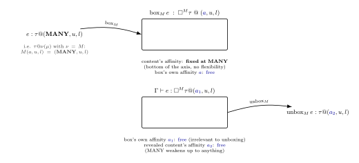
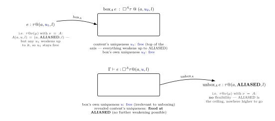
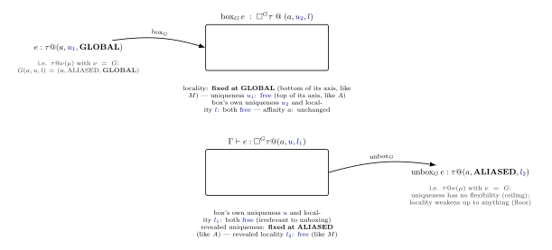

As promised, this post is finally up and has a section by section explanation of
the OxCaml type system - the typing rules, what type contexts are made up of,
the steps taken for inferring modes and the differences between the declarative and
the syntax-directed rules of the type system. These topics cover sections 3 and
Appendix B of the
[paper](https://antonlorenzen.de/papers/oxidizing-ocaml-modal-memory-management.pdf).
I wanted to add bits from section 4 (store semantics) and 5 (conversion to a
graded call-by-value calculus) but they are substantial parts in themselves and
best kept for later.

I hope having working code samples makes this post easy to understand parts of the
paper and mentally put together all the pieces that make up the type system. I have
tried to keep the accompanying
explanations as simple as possible while keeping all the relevant details.

A note on all the code presented in this post: Every block in the post is a
verified toplevel transcript (captured by piping the exact same code through
`ocaml -noprompt` in a switch with OxCaml `5.2`). The code has also been verified
with OxCaml `5.4`. The types/values/errors/line numbers/column numbers
are actual outputs from running these blocks. I have gathered all samples at
[OxCaml modes code](https://gist.github.com/alinab/165d749983de1662d8dbacdf68b791c1). Feel
free to download it and run the file locally if you wish.
If you would rather not install OxCaml locally first,
[Dox](https://lab.julesjacobs.com/dox/page/Welcome?collaborative=1) is an online
playground where you can copy and paste the OxCaml code blocks and have them
run.

## Locks for Closures

Recall that closures are functions that capture something from their surrounding contexts
&mdash; variables, values (lists, records, ...), references
etc. &mdash; and types in OxCaml for contexts and variables are:
([from the previous post](/docs/posts/intro-oxcaml.html)):

```ocaml
Γ ::= ∅ | Γ, x : − | Γ, x : τ @ μ
```

```ocaml
τ ::= 1 | τ + τ | τ × τ | □^ν τ | τ @ μ → τ @ μ | ♣
```

A closure with type `τ @ μ → τ @ μ` capturing a variable with type `τ @ μ` from
it's surrounding environment has to ensure that the mode `μ` of the variable is
acceptable to the closure's input type `μ`. A few rules that hold everywhere:

- With the third axis of a mode triple ($a$, $u$, $l$) being locality  and the sub-moding rule
(`GLOBAL < LOCAL`) - the $l_1$ of the captured variable needs to be the sub-mode of the
closure's $l_2$. A `global` value can be used in a `local` closure, never the other way around. So global closures cannot contain local variables as the local variables might "escape" their region via the global closure being run in another region.

- With the first axis of a mode triple ($a$, $u$, $l$) being affinity and the
  sub-moding rule (`MANY < ONCE`), the $a_1$ of the captured variable needs to be the sub-mode of the closure's $a_2$. Variables marked with `many` can be used in closures marked
`once`.

`Γ,🔒_μ` denotes what a closure of mode `μ = (a₂,u₂,l₂)` is allowed to capture
from its surrounding region. For the second axis, uniqueness, the type system
needs to ensure that `unique` variables are not captured by closures marked
`many`. For this the dagger operation for linking `unique` values that should
only be called `once` is defined as:

```text
  ONCE† := UNIQUE, MANY† := ALIASED
```

The join of the uniqueness $u_1$ for an input variable (on the right hand side
above) and the resulting *daggered affinity* `ONCE†/MANY†` creates an updated
value for the **uniqueness** $u_1$ of the **variable** that is captured. Note it
is not the affinity of the capturing closure, $a_2$ that is being affected, but
the uniqueness of the captured variable driven by the closure's own daggered affinity.

For easy reference, here's the join (`∨`) on each axis directly — the
least upper bound of two values on that axis:

### Affinity (MANY < ONCE)

| ∨    | MANY | ONCE |
|------|------|------|
| MANY | MANY | ONCE |
| ONCE | ONCE | ONCE |

### Uniqueness (UNIQUE < ALIASED)

| ∨       | UNIQUE  | ALIASED |
|---------|---------|---------|
| UNIQUE  | UNIQUE  | ALIASED |
| ALIASED | ALIASED | ALIASED |

### Locality (GLOBAL < LOCAL)

| ∨      | GLOBAL | LOCAL |
|--------|--------|-------|
| GLOBAL | GLOBAL | LOCAL |
| LOCAL  | LOCAL  | LOCAL |

Each axis's join operation that is defined over its own two-element order
collapses the result towards the maximum. Joining with the bottom value
returns the other value unchanged, and joining with the top value always returns
the top since `⊤ ∨ x = ⊤` for any `x`.

The paper defines three
equations for the working of closure locks given a surrounding context:

$$
\emptyset, \text{🔒}_{(a_2, u_2, l_2)} = \emptyset \tag{1}
$$

$$
\Gamma, x : {-}, \text{🔒}_{(a_2, u_2, l_2)} = \Gamma, \text{🔒}_{(a_2, u_2, l_2)}, x : {-} \tag{2}
$$

$$
\Gamma, x : \tau @ (a_1, u_1, l_1), \text{🔒}_{(a_2, u_2, l_2)} = \begin{cases}
\Gamma, \text{🔒}_{(a_2, u_2, l_2)}, x : \tau @ (a_1, \, u_1 \lor (a_2)^\dagger, \, l_2) & \text{if } a_1 \le a_2 \text{ and } l_1 \le l_2 \\
\Gamma, \text{🔒}_{(a_2, u_2, l_2)}, x : {-} & \text{otherwise}
\end{cases} \tag{3}
$$

### Equation (1): locking an empty context

A closure that has no variables to capture from its context does not result in
any change in its context.

```ocaml
# let func_with_closure_empty_context =
    let f = fun z -> z + 100 in
    let y : int @ unique = f 6 in

    print_endline "";
    Printf.printf "%d " y;;

106 val func_with_closure_empty_context : unit = ()
```

`f` captures nothing from its surrounding context and so its context does not change.

### Equation (2): an already-dead variable stays dead

The `x : -` notation stands for a variable that has been fully consumed i.e.
referenced or used. This is specific to the second axis, uniqueness, of a mode
triple ($a$, $u$, $l$). If a closure tries to capture such a value, `μ` (the closure's own
mode) remains unaffected and the captured variable also remains used in the closure context.
Whatever the individual mode axes of the closure may be &mdash; $a_2$ = `once`
or `many`, $l_2$ = `local` or `global` &mdash; a consumed variable remains so
with the closure mode unchanged.

```ocaml
# let id (x @ unique) = x;;
val id : 'a @ unique -> 'a = <fun>
```

```ocaml
# let func_with_closure_captures_used_value =
    let a : int @ unique = 100 in
    let _ = id a in

    let xs : int list = [11;21;31;41;51] in
    let f = fun zs -> rev_append xs [a; zs] in
    let ys : int list @ unique = f 6 in

    print_endline "";
    List.iter (fun x -> Printf.printf "%d " x) ys;;

Line 13, characters 37-38:
13 |     let f = fun zs -> rev_append xs [a; zs] in
                                          ^
Error: This value is used here, but it has already been used as unique:
Line 10, characters 15-16:
10 |     let _ = id a in
                    ^
```

`id a` forces the `a : int @ unique` to be consumed thus marking
it `a : -`. When `f`'s body references the consumed `a`, `a` remains so and
`f` cannot reuse an already-used `unique` value.

### Equation (3): uniqueness with daggers

The third equation holds when `a₁ ≤ a₂` and `l₁ ≤ l₂` hold. The affinity relation
between modes are as follows:

| a₁   | relation | a₂   |
|------|:--------:|------|
| many |    ≤     | once |
| many |    ≤     | many |
| once |    ≥     | many |
| once |    ≤     | once |

The third case `once ≥ many` means that a closure that can be called multiple times
cannot capture a value that's only usable once.

Before tackling the rest of the equation, a `join` is defined as the least upper
bound of two ordered elements (the details/definitions can be refreshed from the
post on [order](/docs/posts/order.html)).

The outcomes of the join `u₁ ∨ a₂†` given `ONCE† := UNIQUE`, `MANY† := ALIASED`,
`UNIQUE < ALIASED` and `MANY < ONCE` for every combination of `u₁` and `a₂†` are:

| u₁      | a₂†     | u₁ ∨ a₂† |
|---------|---------|----------|
| aliased | unique  | aliased  |
| aliased | aliased | aliased  |
| unique  | aliased | aliased  |
| unique  | unique  | unique   |

Each axis's join on elements of its two-element order collapses toward the maximum:
joining with the bottom value returns the other value unchanged, and joining
with the top value always returns the top, since  $\top \lor x = \top$ for any
`x`. Since `unique < aliased`, the least upper bound of the first three cases is
`aliased` and the last case returns the other value (`unique`).

**Note**: The default mode triple values for each mode are (`many`, `aliased`,
`global`).

**Case 1**: Variable `a` captured at `a₁ = many, u₁ = aliased`, `f @ a₂ = once`.
`a₁ = many ≤ a₂ = once` holds.

With `a₂† = once† = unique`, `a` survives the lock at `u₁ ∨ a₂† = aliased ∨ unique = aliased` and thus the variable with uniqueness `aliased` is accepted by the `once` closure.

```ocaml
# let rec rev_append xs acc : _ list @ unique =
    match xs with
    | [] -> acc
    | (x :: rest) -> rev_append rest (x :: acc);;
val rev_append : 'a list @ unique -> 'a list @ unique -> 'a list @ unique =
  <fun>

# let func_with_closure_captures_aliased_value =
    let a : int @ many aliased = 100 in
    let xs : int list @unique = [11;21;31;41;51] in
    let f @ once = fun zs -> rev_append xs [a; zs] in
    let ys : int list @ aliased = f 6 in
    (* ys : int list @ unique = f 6
       would also work — a unique value can always be weakened to aliased *)
    print_endline "";
    Printf.printf "Unique value (can be aliased to):";
     print_endline "";
    List.iter (fun x -> Printf.printf "%d " x) ys;;

Unique value (can be aliased to):
51 41 31 21 11 100 6 val func_with_closure_captures_aliased_value : unit = ()
```

`xs` is separately `@ unique`, and since `f`'s affinity is `once`,
`xs` keeps its uniqueness inside `f` (`unique ∨ unique = unique`),
which is exactly why `rev_append xs [a; zs]` — which needs its first argument
`@ unique` — type-checks correctly.

**Case 2**: With `a₁ = once, u₁ = unique` and  `a₂ = many`,
the dagger operation is `a₂† = many† = aliased` and the join operation is
`u₁ ∨ a₂† = unique ∨ aliased = aliased`.

Here the `u₁ ∨ a₂†` computes to `aliased` which violates `rev_append`'s `@ unique` requirement:

```ocaml
# let func_with_many_closure_fails_captures_unique_value =
    let a : int list @ once unique = [1;2;3;4;5] in
    let f @ many = fun zs -> rev_append a zs in
    let y : int list @ unique = f [6; 7; 8; 9] in
    print_endline "";
    Printf.printf "Aliased value a = %d " a;
    print_endline "";
    Printf.printf "Aliased value y = %d " y;;
Line 4, characters 40-41:
4 |     let f @ many = fun zs -> rev_append a zs in
                                            ^
Error: This value is "aliased"
       because it is used inside the function at Line 4, characters 19-44
       which is expected to be "many".
       However, the highlighted expression is expected to be "unique".
```

`5.4` extends this one further than `5.2.0` did as it now also
traces *why* the highlighted expression needs to be unique, following
the chain back through the list's own `::` cells to `rev_append`'s
own definition.

```mdx-error
Error: This value is aliased
         because it is used inside the function at line 4, characters 19-44
         which is expected to be many.
       However, the highlighted expression is expected to be unique
         because it contains (via constructor ::) the expression at line 4, characters 38-39
         which is expected to be unique
         because it is contained (via constructor ::) in the value at line 4, characters 37-47
         which is expected to be unique.
```

**Case 3**: With `a₁ = many, u₁ = aliased`, `f @ many` i.e. `a₂ = many`.
`a₁ ≤ a₂` holds and `a₂† = many† = aliased`i.e.
`u₁ ∨ a₂† = aliased ∨ aliased = aliased`. With the captured variable and the
closure both aliased, the capturing closure `f` can be called more than once with
no conflict:

```ocaml
# let func_with_many_closure_captures_aliased_value =
    let a : int list @ many = [1;2;3;4;5] in
    let f @ many = fun zs -> a @ zs in
    let y : int list @ aliased = f [6] in
    let z : int list @ aliased = f [7] in
    print_endline "";
    List.iter (fun x -> Printf.printf "%d " x) a;
    print_endline "";
    List.iter (fun x -> Printf.printf "%d " x) y;
    print_endline "";
    List.iter (fun x -> Printf.printf "%d " x) z;;

1 2 3 4 5
1 2 3 4 5 6
1 2 3 4 5 7
val func_with_many_closure_captures_aliased_value : unit = ()
```

**case 4**: With `a₁ = once, u₁ = unique` and `a₂ = once`.
The dagger operation: `a₂† = once† = unique`, the join operation:
`u₁ ∨ a₂† = unique ∨ unique = unique`. `xs @ once` survives the
closure lock operation *and* satisfies `rev_append`'s uniqueness requirement:

```ocaml
# let func_with_once_closure_captures_once_value =
    let xs : int list @ once = [1;2;3;4;5] in
    let f @ once = fun zs -> rev_append xs zs in
    let ys : int list @ unique = f [6] in

    print_endline "";
    List.iter (fun x -> Printf.printf "%d " x) ys;;

5 4 3 2 1 6
val func_with_once_closure_captures_once_value : unit = ()
```

#### `a₁ ≤ a₂` failing, isolated from uniqueness entirely

To construct an example where `a₁ ≤ a₂` fails to hold without `u₁` interfering
with the mode calculation: `once_closure` is itself `@ once` and capturing it inside
`f @ many` is rejected outright.  (Testing `once_closure` brought to light that
it cannot be a top-level binding — top-level structures are implicitly `many`,
so a top-level `@ once` fails immediately. This is likely because top-level
structures are tagged with default mode axes - (many, aliased, global). This is
why `once_closure` is defined inside the `wrapper` function i.e. inside a local
scope.

```ocaml
# let wrapper =
    let once_closure @ once = fun () -> 42 in
    let f @ many = fun () -> once_closure () in
    f;;
Line 3, characters 29-41:
3 |     let f @ many = fun () -> once_closure () in
                                 ^^^^^^^^^^^^
Error: The value "once_closure" is "once" but is expected to be "many"
       because it is used inside the function at Line 3, characters 19-44
       which is expected to be "many".
```

In `5.4`, the error is:

```mdx-error
Error: The value once_closure is once
       but is expected to be many
         because it is used inside the function at line 3, characters 19-44
         which is expected to be many.
```

### The Locality Axis for Closure locks: `l₁ ≤ l₂`

| l₁     | relation | l₂     | holds? |
|--------|:--------:|--------|:------:|
| global |    ≤     | local  |   ✓    |
| local  |    ≤     | global |   ✗    |
| local  |    ≤     | local  |   ✓    |
| global |    ≤     | global |   ✓    |

Unlike affinity, locality *is independently* enforced on the heap. A `@ local` list captured by an `f @ global` closure is rejected outright.

```ocaml
# (* l₁ = global ≤ l₂ = local: holds *)
  let func_global_value_captured_by_local_closure =
    let x : int = 5 in
    let f @ local = fun z -> x + z in
    f 10;;
val func_global_value_captured_by_local_closure : int = 15

# (* l₁ = local ≤ l₂ = local: holds *)
  let func_local_value_captured_by_local_closure =
    let x : int @ local = 5 in
    let f @ local = fun z -> x + z in
    f 10;;
val func_local_value_captured_by_local_closure : int = 15

# (* l₁ = global ≤ l₂ = global: holds (legacy default) *)
  let func_global_value_captured_by_global_closure =
    let x : int = 5 in
    let f @ global = fun z -> x + z in
    f 10;;
val func_global_value_captured_by_global_closure : int = 15
```

`l₁ = local ≤ l₂ = global` fails, but only with a *list* — a plain
`int` does not:

```ocaml
# (* x is a local list *)
  let func_local_value_captured_by_global_closure =
    let x : int list @ local = [1;2;3] in
    let f @ global = fun z -> List.length x + z in
    f 10;;
Line 3, characters 42-43:
3 |     let f @ global = fun z -> List.length x + z in
                                              ^
Error: The value "x" is "local" but is expected to be "global"
       because it is used inside the function at Line 3, characters 21-47
       which is expected to be "global".
```

In `5.4`, the error is:

```mdx-error
Error: The value x is local
       but is expected to be global
         because it is used inside the function at line 3, characters 21-47
         which is expected to be global.
```

```ocaml
# let func_local_int_captured_by_global_closure =
    let x : int @ local = 5 in
    let f @ global = fun z -> x + z in
    f 10;;
val func_local_int_captured_by_global_closure : int = 15
```

`x` is a plain int and is *not allocated on the heap*. An int has no memory
reference to enforce uniqueness or aliasing or use in terms of `many` or `once`.
Lists, closures, and records are boxed (heap-allocated, referenced by pointers),
which is what the modes enforce the use and behaviour for.

## Combining Usages of Variables in Contexts

OxCaml contexts (`Γ ::= ∅ | Γ,x:- | Γ,x:τ@μ`) are built up as a sequence where each
context is either empty or an existing context with exactly one more binding
appended. Because of this, a binding can only reference variables appended
earlier in the sequence, never ones appended later. The partial join operation
`+` combines the usage that two variable terms have in two distinct contexts
assuming  that the two contexts contain the same variables and in the same
order. The `+` operation is used whenever a typing rule has more than one
premise (LET, PAIR, APP, SPLIT, REUSE, BORROW). CASE is a partial exception:
there is only one join with the context shared by both branches of the statement
but these two branches themselves are never separately joined with each other
since match arms are mutually exclusive and only one ever runs.

The first rule is simple - usages with two empty contexts result in an empty
context

### Rule 2: A consumed variable stays dead through the join operation

$$
(\Gamma_1, x{:}{-}) + (\Gamma_2, x{:}{-}) = (\Gamma_1+\Gamma_2), x{:}{-} \tag{4}
$$

```ocaml
# let f_double_fresh_consume =
    let a : int @ unique = 100 in
    (id a, id a);;
Line 5, characters 14-15:
5 |     (id a, id a);;
                  ^
Error: This value is used here, but it is already being used as unique:
Line 5, characters 8-9:
5 |     (id a, id a);;
            ^
```

The pair `(id a, id a)` tries to consume the same unique variable a twice within
one expression; the first `id a` consumes it, and by the time the second `id a`
runs, `a` is already used, exactly matching the error message. This differs from
Rule 2 only in when a becomes dead: here it happens during this very expression,
rather than being already dead from some earlier binding beforehand.

Rule 2 only arises when variable `a` is already `a : -` *before* the split; it
just propagates that consumed variable through both sides uniformly:

```ocaml
# let f_dead_propagates_through_join =
    let a : int @ unique = 100 in
    let _ = id a in        (* a is now a : - *)
    (a + 1, 2);;
Line 6, characters 5-6:
6 |     (a + 1, 2);;
         ^
Error: This value is used here, but it has already been used as unique:
Line 5, characters 15-16:
5 |     let _ = id a in
                   ^
```

`a : -` propagates into the pair element `e1`'s requirement here. `(2, a + 1)`
would fail identically
(into the pair element `e2`'s requirement) confirming the propagation is symmetric.

### Rule 3 and Rule 4: OCaml's `match`/`case`

Rule 3 and Rule 4 (the join proper) are for constructs where both
sub-terms genuinely execute e.g. in constructs such as pairs, applications, lets:

$$
(\Gamma_1, x{:}{-}) + (\Gamma_2, x{:}\tau @\mu) = (\Gamma_1+\Gamma_2), x{:}\tau @\mu \tag{5}
$$

$$
(\Gamma_1, x{:}\tau @\mu) + (\Gamma_2, x{:}{-}) = (\Gamma_1+\Gamma_2), x{:}\tau @\mu \tag{6}
$$

*One side of the equation uses `x` whereas the other doesn't* results in the
joined context inheriting whichever side's mode is still available. The
context with the consumed or unused variable, `x : -` contributes nothing to
the joined context. This can be contrasted with Rule 5, where both contexts in
the join operation use `x`.

```ocaml
# (* rule 3, 4: y used in only ONE component of a real pair - the
     other component doesn't touch y at all, so the joined
     requirement is just "whatever the using side needed."
     once-affinity y is fine. *)
  let pair_uses_y_once (y @ once) = (y, 5);;
val pair_uses_y_once : 'a @ once -> 'a * int @ once = <fun>
```

```ocaml
# (* each arm independently claims a DIFFERENT projection of p
     as unique (fst in one arm, snd in the other) *)
  let match_uses_different_projections (e : int) (p @ unique) =
    match e with
    | 0 -> let x @ unique = p.fst in x
    | _ -> let y @ unique = p.snd in y;;
val match_uses_different_projections : int -> ('a, 'a) pair @ unique -> 'a =
  <fun>
```

`match_uses_different_projections`'s inferred type unifies `pair`'s
two fields to the same `'a` which satisfies the requirement that both branches
must return the same type.

```ocaml
# (* match reusing the SAME projection (p.fst) in both arms. This works
     because only one arm runs, so claiming p.fst as unique in `arm 0 and
      separately, in arm 1 never actually collides in any single execution. *)
  let match_reuses_same_projection (e : int) (p @ unique) =
    match e with
    | 0 -> let x @ unique = p.fst in x
    |_ -> let x @ unique = p.fst in x;;
val match_reuses_same_projection : int -> ('a, 'b) pair @ unique -> 'a =
  <fun>
```

### Rule 5: Both sides aliased forces an affinity upgrade

$$
(\Gamma_1, x{:}\tau @({\_}, \text{ALIASED}, l)) + (\Gamma_2, x{:}\tau
@({\_}, \text{ALIASED}, l)) = (\Gamma_1+\Gamma_2), x{:}\tau @(\text{MANY}, {\_}, l) \tag{7}
$$

The two sides of the join operation (e.g. in a construct where both arms/sides
must be used such as the components of a pair) use `x @ aliased`. The join
forces the combined affinity requirement up to `MANY`. Being read twice (even as
`ALIASED`) means the binding needs to tolerate more than one use and `MANY` is the minimum
affinity that guarantees that.

```ocaml
# (* many-affinity y satisfies the MANY the join demands *)
  let pair_forces_many_and_y_is_many (y @ many aliased) = (y, y);;
val pair_forces_many_and_y_is_many : 'a -> 'a * 'a = <fun>

# (* `y` left unannotated with no explicit affinity:
     the context join silently applies Rule 5 on its own and picks MANY.
     This is invisible in the type printed because MANY happens to be
     the legacy default, so it just looks like an ordinary
     unannotated function. *)
  let pair_forces_many_inferred (y @ aliased) = (y, y);;
val pair_forces_many_inferred : 'a -> 'a * 'a = <fun>
```

```ocaml
# (* Rule 5: y used in BOTH components of a real pair, aliased each
     time. The joined requirement becomes MANY which a once-affinity
     binding can't satisfy that, so this is rejected. *)
  let pair_uses_y_twice (y @ once aliased) = (y, y);;
Line 1, characters 47-48:
1 | let pair_uses_y_twice (y @ once aliased) = (y, y);;
                                                   ^
Error: This value is used here,
       but it is defined as once and is already being used:
Line 1, characters 44-45:
1 | let pair_uses_y_twice (y @ once aliased) = (y, y);;
                                                ^
```

### A Soundness Gap?

Reusing the *same* projection twice in a construct where both sides genuinely
execute (unlike `match`) is *not* rejected, even though it should be.

`x` and `y` below are both declared `@ unique` but underneath they
are same physical array. The result of mutating a unique value `x` in place also
shows up in `y`. This should not happen as `x` and `y` are marked `unique`.
Compared to reusing a *named variable* twice (`id a` in the examples above which
was correctly rejected), this example of "the same record-field projection,
written twice" is not considered a conflictby the type-checker at all:

```ocaml
# type box = { v : int array @@ unique };;
type box = { v : int array; }

# let alias_via_repeated_projection (p @ unique) =
    let x @ unique = p.v in
    let y @ unique = p.v in
    x.(0) <- 999;
    Printf.printf "y.(0) after mutating only x.(0): %d\n" y.(0);;
val alias_via_repeated_projection : box @ unique -> unit = <fun>

# let () = alias_via_repeated_projection { v = [|1;2;3|] };;
y.(0) after mutating only x.(0): 999
```

Note the echoed `type box = { v : int array; }` — the `@@ unique`
modality doesn't show up at all, confirming it's a true no-op: the
toplevel treats it exactly as if unannotated. The `5.4` compiler confirms
this independently, with a compiler diagnostic that reads
`Warning 220 [redundant-modality]: This modality is redundant.`,
a new warning category that doesn't exist in `5.2`. This matches
the no-op conclusion above exactly: Figure 1 in the paper only defines three
real modalities (`A`/aliased, `M`/many, `G`/global, all *restricting* toward an
axis extreme) with no modality to force uniquenes since `unique` is
already the uniqueness axis's least-restrictive end.

The `5.4` compiler apparently just flags what was always true i.e. writing
`@@ unique` never did anything to the value whereas the `5.2` compiler accepted
it silently. `x` and `y` *are unique* as the `@ unique` annotations on `x`
and `y` are not rejected.

A possible question: `Can x and y be aliased (unique treated as aliased) with
p.v remaining unique?`

If either were genuinely tracked as aliased internally, its explicit `@ unique`
ascription would be rejected outright, the same way `sub_aliased_used_as_unique_fails` is
rejected (## SUB rule section) in this post. And since  `UNIQUE < ALIASED` only
weakens in one direction, an `aliased` value can never be moved down to
`unique`. *The compiler accepts both projections as independently unique values without noticing they're the same underlying array.*

For fixing this, p.v's field type would remain a `unique` value. A correct
type-checker should additionally track that projecting the same record field
twice from the same `unique` value produces two references to the same object.
It would treat the second projection the way it rejects a second
reference to the same named `unique` variable. Concretely, a fixed version could
reject the second projection outright or only accept it as `@aliased` since
something already claimed `unique` can still be handed out again as `aliased`,
but not as a second independent unique reference.

### Order Between Contexts

The last two equations for ordering contexts are:

$$
\Gamma, x : {-}, \Gamma' \geq \Gamma, x : \tau @\mu, \Gamma' \tag{8}
$$

$$
\Gamma, x : \tau @\mu_1, \Gamma' \geq \Gamma, x : \tau @\mu_2, \Gamma' \quad
\text{if } \mu_1 \geq \mu_2 \tag{9}
$$

The order denoted by `≥` in (8) is as follows: a context in which the variable
is dead is more general than a context where it has a specific type τ@μ.
Anything derivable under the more specific assumption also holds under the
more general one, since a term that doesn't use x works regardless of what
x's real mode is

In (9), the order is that if modes are ordered as: $\mu_1$ $\geq$ $\mu_2$
the context $\mu_1$ is more general than $\mu_2$. For the default values of mode triples,
affinity and locality ($a_2$ = `@ many`, $l_2$ = `@ global`), mode ascriptions are used on
types to obtain a "narrower" or "stronger" type ($a_1$ = `@ once`, $l_1$ = `@ local`).

The uniqueness mode is different with `UNIQUE < ALIASED` and `@ aliased` as the
default. So `@aliased` is the "weaker" value in this modality than a `@unique`
one where a value must have only one reference.

## A Sense of the Type System So Far

So far, the locking rules for the capture of variables by closures and combining
usages of variables in contexts have brought an intuition, albeit limited, in
how the type system handles computation. In the case of capturing in closures,
care is taken that for affinities $a_1$ ≤ $a_2$, the join operation (`∨`) swings the
uniqueness of the captured variable towards the weaker `ALIASED` modality whenever
the closure's own affinity is `many` (since `many† := ALIASED`). When the closure's
affinity is `once` instead (`once† := UNIQUE`), the join can preserve `unique` if
the variable was already unique — the uniqueness only gets widened to `aliased`
when the closure's affinity genuinely demands it. The idea is to allow maximum
leeway for either `unique` or `aliased` variables to be used in the capturing
closure. These rules can be thought of as forming a mesh where values at least as
strong as what the closure requires pass through, weaker ones are rejected.

For contexts, the usage of a variable/binding is always irreversible &mdash;
a binding once used can never be revived or reused.

**An important point to keep in mind:** the notation `x : −` is used to both
denote a variable already used and a variable never used in the current context
(this point is reiterated in the [context splitting](#context-splitting) section).

## Type system Rules

### The `VAR` rule

$$
\dfrac{}{\Gamma, x:\tau @ \mu, \Gamma' \vdash x : \tau @ \mu} \ \text{VAR}
$$

Let's start with this sentence: *The var rule is standard, which may be surprising to the reader familiar with modal calculi*

The locking mechanism described for closures is called a
[Fitch-style](https://en.wikipedia.org/wiki/Fitch_notation) lock.
In modal calculus, of which OxCaml is an instance, the lock marks a boundary
that either blocks access to what's behind/within it, or forces whatever crosses it to
be attenuated according to the lock's own modality. Recall from
[Locks for Closures](#locks-for-closures) that this attenuation is exactly the
join (`∨`) between $u_1$ (the variable's uniqueness) and $a_2^\dagger$ (the
daggered affinity of the closure) applied to the context itself as the lock
is added, before `VAR` ever runs.

In modal logics, the `VAR` rule itself would usually have a side condition
e.g. "variable x's mode is compatible with every intervening lock in the
context". But in this `VAR` rule, `x` is unconditionally granted type `τ@μ`
regardless of what's sitting between the binding and the point of use
because that compatibility check, and any resulting attenuation, has already
been folded into $\Gamma'$ by the lock equations themselves.

In this declarative version of `VAR`, locking is an operation on the context,
applied as closures are entered. Since `x` is bound before $\Gamma'$ in the
context sequence, any lock introduced by a closure capturing `x` becomes part
of $\Gamma'$, and its effect has already been applied there by the time `VAR`
reads off `x`'s mode. The algorithmic `VAR` rule, described
[later](#the-algorithmic-var-locks-accumulated-across-closures), will treat
locks lazily and hence require a different treatment.

### The `SUB` rule

$$
\dfrac{\Gamma_1 \ge \Gamma_2 \qquad \mu_1 \le \mu_2 \qquad \Gamma_1 \vdash e : \tau @ \mu_1}{\Gamma_2 \vdash e : \tau @ \mu_2} \ \text{SUB}
$$

The $\Gamma_1 \ge \Gamma_2$ premise means $\Gamma_1$ is the more general
(poorer/less-restrictive) context and $\Gamma_2$ is the richer/stricter one —
this is a comparison about how much the context assumes regarding *other*
variables, independent of what mode `e` itself ends up with. For example, per
Equation (8), $\Gamma_1$ can have a variable at `x : -` where $\Gamma_2$ has
the same variable at a real mode `τ@μ`; here `x : -` means `x` has no free
occurrence in the term being typed.

Separately, the `SUB` rule's own premise concerns `e`'s mode directly: $\mu_1$
is the mode `e` is derived to have under $\Gamma_1$, and $\mu_2$ is the mode
`e` is derived to have under $\Gamma_2$ — with $\mu_1$ the stronger (tighter)
mode and $\mu_2$ the weaker one. So $\Gamma_1$ is both the more general context
*and* the one under which `e` gets the stronger mode.

The rule says that a term that already type-checks under a poorer or less
restrictive context certainly also type-checks under any richer context.
In terms of sub-moding: `μ1` (the stronger mode) can always be used where `μ2` (the weaker mode)
is expected but the reverse can never hold. This is similar to subtyping where
a subtype can be substituted for a supertype but it is most important to
note: *sub-moding is not sub-typing! This SUB rule does not change the type, only the mode*

The same pattern holds on all three axes: `μ1` (tighter) used as `μ2` (weaker) always works; the reverse always fails.

```ocaml
# (* uniqueness: unique ≤ aliased *)
  let sub_unique_used_as_aliased =
    let a : int list @ unique = [1;2;3] in
    let b @ aliased = a in
    b;;
val sub_unique_used_as_aliased : int list = [1; 2; 3]
```

```ocaml
# (* the reverse direction:
     aliased ≥ unique is correctly rejected. *)
  let sub_aliased_used_as_unique_fails =
    let a : int list @ aliased = [1;2;3] in
    let b @ unique = a in
    b;;
Line 3, characters 21-22:
3 |     let b @ unique = a in
                         ^
Error: This value is "aliased" but is expected to be "unique".
```

```ocaml
# let rec length_local (xs : 'a list @ local) : int =
    match xs with
    | [] -> 0
    | _ :: tl -> 1 + length_local tl;;
val length_local : 'a list @ local -> int = <fun>
```

```ocaml
# (* locality: global ≤ local. Uses length_local (defined above)
     rather than List.length, since List.length isn't locality-polymorphic in this stdlib snapshot. *)
  let sub_global_used_as_local =
    let a : int list @ global = [1;2;3] in
    let b @ local = a in
    length_local b;;
val sub_global_used_as_local : int = 3
```

```ocaml
# (* the reverse: local ≥ global is correctly rejected. *)
  let sub_local_used_as_global_fails =
    let a : int list @ local = [1;2;3] in
    let b @ global = a in
    b;;
Line 3, characters 21-22:
3 |     let b @ global = a in
                         ^
Error: This value is "local" but is expected to be "global".
```

```ocaml
# (* affinity: many ≤ once. This example
     uses a closure as affinity is enforced for closures *)
  let sub_many_used_as_once =
    let a @ many = fun () -> 42 in
    let b @ once = a in
    b ();;
val sub_many_used_as_once : int = 42
```

```ocaml
# (* the reverse: once ≥ many is correctly rejected. *)
  let sub_once_used_as_many_fails =
    let a @ once = fun () -> 42 in
    let b @ many = a in
    b;;
Line 3, characters 19-20:
3 |     let b @ many = a in
                       ^
Error: This value is "once" but is expected to be "many".
```

## The `LAM` rule: result mode fixed vs. inferred

$$
\dfrac{\Gamma, \text{🔒}_{\mu_3}, x : \tau_1 @\mu_1 \vdash e : \tau_2 @\mu_2}{\Gamma \vdash \lambda x.\, e : (\tau_1 @\mu_1 \to \tau_2 @\mu_2) @\mu_3} \ \text{LAM}
$$

In this rule, the closure `λx.e` itself has mode $\mu_3$ which is also the mode
of the lock $\text{🔒}_{\mu_3}$ applied to the context while checking the body
e. The locking mechanism for closures attenuates whatever e captures from the
outer context $\Gamma$. `x` is the function's own parameter and bound directly
at mode $\mu_1$ alongside the lock (not
itself subject to the lock's dagger/join machinery). Note that the shape
`Γ, 🔒_μ3, x:τ1@μ1` looks identical to what the lock-transform equations from
[Locks for Closures](#locks-for-closures) section would *produce* by rewriting an
existing binding but here `x` is being freshly introduced by `λx` itself,
not rewritten from some prior binding already in $\Gamma$. The premise is
built by direct construction, not by running the attenuation formula on `x`.
The body e is then checked to have mode $\mu_2$ giving the function type
(`τ1@μ1 → τ2@μ2`).

`μ3` (the closure's own mode) is either fixed by explicit annotation and then
*checked* against the captured variable(s) or the closure is left unannotated
and *inferred* from constraints for what the body captures, and how the closure is later used (called once vs. called many times).

```ocaml
# let restricted_closure_extended =
    let xs_1 : int list @ unique = [1;2;3;4;5] in
    let xs_2 : int list @ unique = [1;2;3;4;5] in

    let f = fun ls -> rev_append xs_1 ls in
    let ys = f [6] in
    print_endline "";
    List.iter (fun x -> Printf.printf "%d " x) ys;

    let g @ once = fun ls -> rev_append xs_2 ls in
    let zs = g [7] in
    print_endline "";
    List.iter (fun x -> Printf.printf "%d " x) zs;;

5 4 3 2 1 6
5 4 3 2 1 7 val restricted_closure_extended : unit = ()
```

In the above snippet, function `f` is unannotated and captures `xs_1 @ unique`.
The lock mechanism for the closure decides that `f` is `@ once` as the closure wants
`xs_1` to stay unique. The function `f` is called only once and so the entire
chunk is correct. Function `g` is the same as `f` except the `@ once` annotation
is made explicit.

```ocaml
# let restricted_closure_extended_h_fails =
    let xs_3 : int list @ unique = [1;2;3;4;5] in
    let h = fun ls -> rev_append xs_3 ls in
    let ws1 = h [8] in
    let ws2 = h [9] in
    print_endline "";
    List.iter (fun x -> Printf.printf "%d " x) ws1;
    print_endline "";
    List.iter (fun x -> Printf.printf "%d " x) ws2;;
Line 5, characters 14-15:
5 |     let ws2 = h [9] in
                   ^
Error: This value is used here,
       but it is defined as once and has already been used:
Line 4, characters 14-15:
4 |     let ws1 = h [8] in
                  ^
```

Defining a closure `h` which is the same as `f` but
is called *twice* creates a genuine conflict: the capturing closure determines
`h @ once` (to keep `xs_3` usable at `unique` inside `rev_append`) but the call
`h [9]` now requires `h @ many` (called more
than once) — there is no mode for `h` that satisfies both, so it's rejected on
the second call.

## The `UNIT` rule

$$
\dfrac{}{\Gamma \vdash () : \mathbb{1} @ \mu} \ \text{UNIT}
$$

A unit value is assigned the unit type $\mathbb{1}$
at any mode $\mu$ as the rule's premise is empty and places no constraint on
$\mu$ at all. The unit value has no affinity or uniqueness or locality to
grapple with and so assigning any mode is valid.

## The Sum types: `INL`, `INR`, `CASE` rules

$$
\dfrac{\Gamma \vdash e : \tau_1 @\mu}{\Gamma \vdash \text{inl}\ e : \tau_1 + \tau_2 @\mu} \ \text{INL}
\qquad\qquad
\dfrac{\Gamma \vdash e : \tau_2 @\mu}{\Gamma \vdash \text{inr}\ e : \tau_1 + \tau_2 @\mu} \ \text{INR}
$$

$$
\dfrac{\Gamma_1 \vdash e_1 : \tau_1 + \tau_2 @\mu_1 \qquad \Gamma_2, x_1 : \tau_1 @\mu_1 \vdash e_2 : \tau_3 @\mu_2 \qquad \Gamma_2, x_2 : \tau_2 @\mu_1 \vdash e_3 : \tau_3 @\mu_2}{\Gamma_1+\Gamma_2 \vdash \text{case}\ e_1\ \{\text{inl}\ x_1 \to e_2; \text{inr}\ x_2 \to e_3\} : \tau_3 @\mu_2} \ \text{CASE}
$$

The `INL`/`INR` rules are mode-preserving: wrapping an expression in an `inl` or
`inr` constructor doesn't affect its mode. The `CASE` rule takes the context
$\Gamma_1$ and mode $\mu_1$ and recovers the individual types with this
mode. The bound variables `x1`, `x2` both get `μ1` with the resulting mode of
the rule being the computed mode for both $e_2$ and $e_3$ which is $\mu_2$.

```ocaml
# type ('a, 'b) sum = Left of 'a | Right of 'b;;
type ('a, 'b) sum = Left of 'a | Right of 'b

# (* INL: wrapping a @ unique payload gives a @ unique sum, with no extra annotation - the mode is just inherited. *)
  let wrap_unique (xs : int list @ unique) : (int list, int) sum @ unique = Left xs;;
val wrap_unique : int list @ unique -> (int list, int) sum @ unique = <fun>

# (* CASE: destructuring recovers the payload at the sum's own mode - a @ unique sum's Left payload is usable at unique. *)
  let unwrap_and_reverse (s : (int list, int) sum @ unique) =
    match s with
    | Left xs -> rev_append xs []
    | Right _ -> [];;
val unwrap_and_reverse : (int list, int) sum @ unique -> int list = <fun>
```

In contrast to the above example, an `@ aliased` sum's payload can only be recovered at
`aliased` since the mode for any arm is tied exactly to `μ1`, the sum value's
own mode. In the example, the compiler's error names the constructor path directly:

```ocaml
# let unwrap_aliased_and_try_unique (s : (int list, int) sum @ aliased) =
    match s with
    | Left xs -> rev_append xs []
    | Right _ -> [];;
Line 3, characters 28-30:
3 |     | Left xs -> rev_append xs []
                                ^^
Error: This value is "aliased"
       because it is contained (via constructor "Left") in the value at Line 3, characters 6-13
       which is "aliased".
       However, the highlighted expression is expected to be "unique".
```

The `5.4` compiler extends this one further than `5.2` by tracing *why* the highlighted expression needs to be unique, following the chain
back through the list's own `::` cells (same further-chain pattern as elsewhere in this post):

```mdx-error
Error: This value is aliased
         because it is contained (via constructor Left) in the value at line 3, characters 6-13
         which is aliased.
       However, the highlighted expression is expected to be unique
         because it contains (via constructor ::) the expression at line 4, characters 36-37
         which is expected to be unique
         because it is contained (via constructor ::) in the value at line 4, characters 35-45
         which is expected to be unique.
```

A point to note about contexts is that the inferred type and mode for the `CASE`
construct is obtained by checking under a joined context $\Gamma_1$ + $\Gamma_2$
that joins usages from both.

## The `PAIR` rule

$$
\dfrac{\Gamma_1 \vdash e_1 : \tau_1 @\mu \qquad \Gamma_2 \vdash e_2 : \tau_2 @\mu}{\Gamma_1+\Gamma_2 \vdash (e_1, e_2) : \tau_1 \times \tau_2 @\mu} \ \text{PAIR}
$$

In this rule, two distinct variables or expressions are each typed in separate
contexts but have the *same mode*.

```ocaml
# let pair_disjoint_unique_uses : (int list * int list) @ unique =
    let p : int list @ unique = [1;2;3] in
    let q : int list @ unique = [4;5;6] in
    (p, q);;
val pair_disjoint_unique_uses : int list * int list = ([1; 2; 3], [4; 5; 6])
```

In the above sample, `p` is used only in `e1`, `q` only in `e2` so:

- `Γ1 = {p:unique, q:-}` and
- `Γ2 = {p:-, q:unique}` —

The partial join of `Γ1` with `Γ2` results in a context `Γ1+Γ2` with
`{p:unique, q:unique}` with a `unique` mode. (Note that the `PAIR` rule's mode `μ` is shared
across both premises and the conclusion). This is exactly Rule 3/4 (from
joining contexts) applied to each variable individually unlike in Rule 5 where the same
variable is live in both components.

## The `SPLIT` rule

$$
\dfrac{\Gamma_1 \vdash e_1 : \tau_1 \times \tau_2 @\mu_1 \qquad \Gamma_2, x :
\clubsuit \hspace{0.2em} @\mu_1, y : \tau_1 @\mu_1, z : \tau_2 @\mu_1 \vdash e_2 :
\tau_3 @\mu_2}{\Gamma_1+\Gamma_2 \vdash \text{let}\ (x, y, z) = e_1\ \text{in}\
e_2 : \tau_3 @\mu_2} \ \text{SPLIT}
$$

Here an expression $e_1$ with type $\tau_1 \times \tau_2$ and mode $\mu_1$ is
split into two
values `y` and `z`. After the split, the allocation associated with $e_1$ is now
associated with variable `x` as a *space-credit*. This means any other program
construct wishing to reuse the space that $e_1$ occupied can now use the credit
stored in `x` within $e_2$. The variables `y` and `z` inherit their mode from
the input pair and so does the space-credit `x`, since all three share the
same $\mu_1$. Since `x` inherits the original pair's mode this way, it can only
later be reused (by the `REUSE` rule) when that mode is `unique`.

## The `LET` rule

$$
\dfrac{\Gamma_1 \vdash e_1 : \tau_1 @\mu_1 \qquad \Gamma_2, x : \tau_1 @\mu_1 \vdash e_2 : \tau_2 @\mu_2}{\Gamma_1+\Gamma_2 \vdash \text{let}\ x = e_1\ \text{in}\ e_2 : \tau_2 @\mu_2} \ \text{LET}
$$

Given an expression $e_1$ in a context $\Gamma_1$ and a variable `x` bound in
`Γ2` at *exactly* the same type and mode ($\tau_1 @\mu_1$), the resulting binding can be used in $e_2$.

Let's go over a few examples:

```ocaml
# (* uniqueness: x is aliased, e2 needs unique. *)
  let let_uniqueness =
    let x : int list @ aliased = [1;2;3] in
    rev_append x [];;
Line 3, characters 15-16:
3 |     rev_append x [];;
                   ^
Error: This value is "aliased" but is expected to be "unique".
```

OxCaml `5.2` reported this one as a single, unexpanded line; `5.4`
gives it the same deeper `::`-chain explanation as described in previous
examples:

```mdx-error
Error: This value is aliased
       but is expected to be unique
         because it contains (via constructor ::) the expression at line 4, characters 36-37
         which is expected to be unique
         because it is contained (via constructor ::) in the value at line 4, characters 35-45
         which is expected to be unique.
```

```ocaml
# (* affinity: f bound to @ once, e2 calls it twice. *)
  let let_affinity =
    let f @ once = fun () -> 42 in
    (f (), f ());;
Line 3, characters 11-12:
3 |     (f (), f ());;
               ^
Error: This value is used here,
       but it is defined as once and is already being used:
Line 3, characters 5-6:
3 |     (f (), f ());;
         ^
```

```ocaml
# (* locality: x bound at @ local, e2 tries to return it,
     escaping the enclosing region. *)
  let let_locality () =
    let x : int list @ local = [1;2;3] in
    x;;
Line 3, characters 4-5:
3 |     x;;
        ^
Error: This value is "local"
       but is expected to be "local" to the parent region or "global"
       because it is a function return value.
       Hint: Use exclave_ to return a local value.
```

The compiler's `exclave_` hint points at a real OxCaml feature for
deliberately returning a local value into the parent region — a detail we will
look at later in the section on [tail calls](#notes-on-surface-language-design-decision---regions-and-tail-calls)

## The `BOX`/`UNBOX` rule

$$
\dfrac{\Gamma \vdash e : \tau @ \nu(\mu)}{\Gamma \vdash \text{box}_\nu\ e : \Box^\nu\tau @\mu} \ \text{BOX}
\qquad\qquad
\dfrac{\Gamma \vdash e : \Box^\nu\tau @\mu}{\Gamma \vdash \text{unbox}_\nu\ e : \tau @ \nu(\mu)} \ \text{UNBOX}
$$

In the `BOX` rule, an expression `e` has a modality $\nu$ applied to mode $\mu$.
This results in e being put into a box with a modality $\nu$ and mode $\mu$. It
pays to read the rule carefully - the calculated mode $\nu(\mu)$ for `e` is
different from that of the $\text{box}_\nu\ e$ which is $\mu$. The box is tagged
with **modality** $\nu$ while keeping its mode at $\mu$.

The `UNBOX` rule reverses `BOX` by taking a boxed expression at $\Box^\nu\tau$
(type $\tau$ wrapped in modality $\nu$) and mode $\mu$. It uses the modality to
reconstruct the mode for the expression that had been put into this box by calculating $\nu(\mu)$.

Through both these rules, the type is what visibly changes (gaining or losing the box wrapper); the mode itself is recomputed fresh via ν(μ) each time, not carried over from before boxing.

`box_v`/`unbox_v` are not keywords in the expression language. Using `grep`
to search the lexer source for a switch containing OxCaml 5.2 turned up
`"overwrite_"` and `"borrow_"` as tokens. The boxing and unboxing type
rules apply to data structures such as records with fields. The mechanism to box
a record with a mode $\nu(\mu)$ is to tag its fields with modality $\nu$ using the
`@@` operator. The `[@@unboxed]` wrapper types for all three modalities `A`,
`M`, `G` are defined below.

```ocaml
# type 'a aliased = { a : 'a @@ aliased } [@@unboxed];;
type 'a aliased = { a : 'a @@ aliased; } [@@unboxed]

# type 'a many = { m : 'a @@ many } [@@unboxed];;
type 'a many = { m : 'a @@ many; } [@@unboxed]

# type 'a global = { g : 'a @@ global } [@@unboxed];;
type 'a global = { g : 'a @@ global; } [@@unboxed]
```

The `[@@unboxed]` keyword makes these wrappers not have any *run-time* cost as
there is no allocation and hence no indirection. It is purely compile-time
bookkeeping which expresses the abstract `BOX`/`UNBOX` rules. For example,
building a record such as:
`type point = { x : int @@ aliased; y : int list @@ aliased }` boxes both fields
`x` and `y` to be `aliased` even if an instance of type `point` is `unique` e.g.
`let z @ unique = {x = 10; y = [1;2;3]}`. The reverse is
achieved in projecting `z.x` resulting in the original mode `aliased` which
is the field's own tag.

Using `@` for mode ascription is always distinct from using `@@` for mode
boxing. The `BOX` rule always changes the *type*, from $\tau$ to the box type
$\Box^\nu\tau$ (in the example: from `int list` to `int list aliased`).

Everything below has to be nested inside *one* top-level `let _` as
a top-level `let` becomes part of the module's interface, so a *later, separate*
top-level `let` referencing it gets conservatively downgraded to `aliased`,
regardless of its originally declared mode:

```ocaml
# let _ =
     let x_for_box : int list @ unique = [1;2;3] in
     let z_real_box : int list aliased @ unique = { a = x_for_box }  in
     (* z_real_box is unique while its field a is boxed to aliased *)
     let z_unboxed_back @ unique = z_real_box in
     let z_unboxed_project_a @ aliased = z_real_box.a
     (* z_real_box.a recomputes ν(μ) = aliased(unique). The `aliased`
        modality forces the uniqueness axis to ALIASED outright (the
        top of UNIQUE < ALIASED); the input is ignored entirely,
        regardless of z_real_box's own @unique mode and regardless
        of x_for_box's original @unique mode. *)
     in (z_unboxed_project_a, z_unboxed_back);;

- : int list * int list aliased = ([1; 2; 3], {a = [1; 2; 3]})
```

The `@@` modality tags are applicable on any field inside any record.

```ocaml
# type point = { x : int; y_aliased : int list @@ aliased };;
type point = { x : int; y_aliased : int list @@ aliased; }

# let p_mixed_mode : point @ unique = { x = 5; y_aliased = [1;2;3] };;
val p_mixed_mode : point = {x = 5; y_aliased = [1; 2; 3]}
```

`p` can be `@ unique` as a whole even though `y_aliased`'s content is pinned to
`aliased`.

## The `BORROW` rule

A recap of constructs and rules related to borrowing values will be helpful
before going through the actual typing rule.

1. **The real language primitive.** `borrow_` is a plain unary
   prefix operator, `borrow_ x`, taking one expression.
   The parser grammar (`oxcaml-compiler.5.2.0minus31/parsing/parser.mly`)
   confirms this.

   ```ocaml
   BORROW simple_expr %prec below_HASH
       { Exp.borrow ~loc:(make_loc $sloc) $2 }
   ```

   `borrow_` is the implemented equivalent of the paper's Rust-style
   `&x` notation.

2. **The paper's combinator.** `val borrow : 'a @ unique ->
   ('a @ local -> 'b) -> ('a * 'b aliased) @ unique` is an
   ordinary function built *using* `borrow_`. This function was previously
   used in the [`sneaky` example](/docs/posts/intro-oxcaml.html).

   ```ocaml
   let borrow x f = let result = f (borrow_ (x : 'a @ local))
         in (x : 'a @ unique), { a = result }
   ```

3. **The `BORROW` typing rule** :

   $$
   \dfrac{\begin{gathered}
   \Gamma_1 \vdash e_1 : \tau_1 @ (\text{MANY}, u_1, l_1) \qquad \Gamma_2, x : \tau_1 @ (\text{MANY}, \text{ALIASED}, \text{LOCAL}) \vdash e_2 : \tau_2 @ (a_2, u_2, \text{GLOBAL}) \\
   \Gamma_3, x : \tau_1 @ (\text{MANY}, u_1, l_1), y : \tau_2 @ (a_2, u_2, \text{GLOBAL}) \vdash e_3 : \tau_3 @\mu
   \end{gathered}}{\Gamma_1+\Gamma_2+\Gamma_3 \vdash \text{borrow}\ x = e_1\ \text{for}\ y = e_2\ \text{in}\ e_3 : \tau_3 @\mu} \ \text{BORROW}
   $$

   `borrow x = e1 for y = e2 in e3` "borrows" the result of evaluating a
   value $e_1$ with a fixed `MANY` affinity (its uniqueness and locality,
   $u_1$, $l_1$, are unconstrained) as long as $e_2$ is in scope. `x` is
   `aliased` i.e. cannot be updated as it is no longer unique in $e_2$ as
   well as `local` to $e_2$. *After* $e_2$ is evaluated, $e_1$'s mode is
   restored to its original (`MANY`, $u_1$, $l_1$) triple. $e_2$'s own result is
   bound to `y` at ($a_2$, $u_2$, `GLOBAL`). The third component of `y`'s mode
   triple must be `global` because it must be able to survive past the end of
   the borrowed region. `e3` then gets both `x` (restored to its full original
   mode, including its original locality) and `y`.

<div class="diagram-wide">

</div>

## The `REUSE` rule

$$
\dfrac{\Gamma_1 \vdash e_1 : \clubsuit @ (\_, \text{UNIQUE}, \text{GLOBAL}) \qquad \Gamma_2 \vdash e_2 : \tau_1 @ (a, u, \text{GLOBAL}) \qquad \Gamma_3 \vdash e_3 : \tau_2 @ (a, u, \text{GLOBAL})}{\Gamma_1+\Gamma_2+\Gamma_3 \vdash \text{reuse}\ e_1\ \text{in}\ (e_2, e_3) : \tau_1 \times \tau_2 @ (a, u, \text{GLOBAL})} \ \text{REUSE}
$$

This rule has $e_1$ associated with a `UNIQUE` and `GLOBAL` space-credit i.e. a
unique location in the heap. Any two other *global* values, $e_2$ and $e_3$, can
use this space to construct a pair type $\tau_1 \times \tau_2$ with mode
`GLOBAL`. The requirement for both $e_2$ and $e_3$ to be global values is
because if they were local, they would be local to a region on the stack. If that
region were to no longer exist, the heap would have a reference to now-absent
value in memory.

## The Algorithmic `VAR`: locks accumulated across closures

OxCaml's type inference algorithm can infer all types and modes in a program.
Modes are inferred by a constraint solver whose workings are laid out in the next [section](#the-mechanics-of-mode-inference). The mode constraints that are needed for
this inference cannot be generated based on the typing rules shown so far
because the `LAM` rule uses locks acting on modes in $\Gamma$ which are still
being inferred for other bindings in it.

A variable can be captured through several nested lambdas as in this fragment:

```ocaml
# let x = 10 in
  let g = fun z ->
    let f = fun y -> y + x in
    f z
  in
  g 5;;
- : int = 15
```

The variable accumulates one lock per nesting level in the context:

  `Γ ::= ∅ | Γ,x:- | Γ,x:τ@μ | Γ,🔒μ`

and only when it's actually referenced within a closure
does `VAR` sweep up *all* the intervening locks at once by the following rule:

$$
\dfrac{\begin{gathered}
a_1 \le \Big(a_2 \land \bigwedge_{\text{🔒}_{(a_i, \ldots)} \in \Gamma'} a_i\Big) \qquad u_1 \lor \bigvee_{\text{🔒}_{(a_i, \ldots)} \in \Gamma'} \dagger(a_i) \le u_2 \\
l_1 \le \Big(l_2 \land \bigwedge_{\text{🔒}_{(\ldots, l_i)} \in \Gamma'} l_i\Big)
\end{gathered}}{\Gamma, x : \tau @ (a_1, u_1, l_1), \Gamma' \vdash x : \tau @ (a_2, u_2, l_2)} \ \text{VAR}
$$

**The Affinity axis**: The first inequality's RHS is a meet (`∧`) over $a_2$
and every intervening lock's own affinity. Here $a_1$ is the affinity of the
captured variable, $a_2$ is the affinity of the closure and there can be `i`
intervening levels between where `x` is defined and where it is called via
capture in a context $\Gamma'$.

On the two-element chain/two-value mode axis, `MANY < ONCE`,
the meet or greatest lower bound of values collapses to the value on the
left side of the relation which is `MANY` in this case. If *any* of the
intervening closures (or $a_2$ itself) has a `MANY` affinity, the entire
meet result is a `MANY`. This makes `a1 ≤ MANY` resulting in `a1 = MANY`
regardless of how many of the *other* closure affinities were marked `ONCE`.

```ocaml
# let wrapper =
    let once_val @ once = fun () -> 42 in
    let outer @ many = fun () ->
      let inner @ once = fun () -> once_val () in
      inner ()
    in
    outer ();;
Line 4, characters 35-43:
4 |       let inner @ once = fun () -> once_val () in
                                       ^^^^^^^^
Error: The value "once_val" is "once" but is expected to be "many"
       because it is used inside the function at Lines 3-5, characters 23-14
       which is expected to be "many".
```

`5.4` gives the same output with a slightly different message layout:

```mdx-error
Error: The value once_val is once
       but is expected to be many
         because it is used inside the function at lines 3-5, characters 23-14
         which is expected to be many.
```

`once_val` with mode `once` is captured by `inner @ once`. However, the
intervening `outer @ many` contributes a `many` affinity into the meet on
the inequality's right-hand side alongside `inner`'s own `once`. Since
`many` is the bottom of the affinity order, the outcome of the meet operation
collapses to `many` regardless of `inner`'s own declared mode. `once_val`'s own
affinity (`a1 = once`) fails the check `a1 ≤ many` since `once` can never be `≤ many`.

In contrast, in the following snippet, the nesting is identical to the
fragment above with only `outer` marked with mode `once`. Now the code
compiles correctly:

```ocaml
# let wrapper_no_many =
    let once_val @ once = fun () -> 42 in
    let outer @ once = fun () ->
      let inner @ once = fun () -> once_val () in
      inner ()
    in
    outer ();;
val wrapper_no_many : int = 42
```

**The Uniqueness axis**: For this axis, `UNIQUE ≤ ALIASED`. A join
operation (`∨`) always tilts towards the least upper bound or the higher
(upper) value in the two-element order. Here $u_1$ is the captured variable's
own uniqueness, $u_2$ that of the closure itself and $\dagger(a_i)$ is
the dagger operation performed for the affinity of each intervening closure.
The location of the dagger symbol is on the left of $a_i$, unlike in the
[Locks for Closures](#locks-for-closures) section, where $a_2$ is a
concrete, already-elaborated closure's affinity. Here $a_i$ ranges over
intervening closures whose modes may still be unresolved at
constraint-generation time. As the $\dagger$ function is invertible (or
a bijection between the two two-element chains), either side
of $\dagger(a_i)$ can be the one still unknown — the solver can compute
$\dagger(a_i)$ once $a_i$ is fixed, or recover $a_i$ once the required
uniqueness value is fixed by
some other constraint. *(**This isn't stated outright in the paper, but is a
reasonable inference given how the constraint-solving algorithm is described.**)*

If any intervening lock has $a_i$ = `MANY` (so †($a_i$) = `ALIASED`,
since `MANY`† = `ALIASED`) anywhere in the chain, the value of $u_1$ itself
or any other `ONCE` locks (`ONCE† = UNIQUE`) is subsumed in the join. The mode
for $u_2$ (the use-site/closure) is updated with the result of the join.

```ocaml
# let wrapper_unique_chain =
    let xs : int list @ unique = [1;2;3] in
    let outer @ many = fun () ->
      let inner @ once = fun () -> rev_append xs [] in
      inner ()
    in
    outer ();;
Line 4, characters 46-48:
4 |       let inner @ once = fun () -> rev_append xs [] in
                                                  ^^
Error: This value is "aliased"
       because it is used inside the function at Lines 3-5, characters 23-14
       which is expected to be "many".
       However, the highlighted expression is expected to be "unique".
```

OxCaml `5.4` additionally traces why the highlighted expression needs to be
unique, following the chain back through the list's own `::` cells (same
further-chain pattern as elsewhere in this post):

```mdx-error
Error: This value is aliased
         because it is used inside the function at lines 3-5, characters 23-14
         which is expected to be many.
       However, the highlighted expression is expected to be unique
         because it contains (via constructor ::) the expression at line 4, characters 36-37
         which is expected to be unique
         because it is contained (via constructor ::) in the value at line 4, characters 35-45
         which is expected to be unique.
```

In the following snippet, `outer` is marked `once`. With no `MANY` modes anywhere
in the chain of closures between `outer` and `xs`, within `rev_append`, when
`xs` is called, its mode remains `unique`:

```ocaml
# let wrapper_unique_chain_no_many =
    let xs : int list @ unique = [1;2;3] in
    let outer @ once = fun () ->
      let inner @ once = fun () -> rev_append xs [] in
      inner ()
    in
    outer ();;
val wrapper_unique_chain_no_many : int list = [3; 2; 1]
```

**The Locality axis**: Values in the locality mode axis are related as
`GLOBAL` < `LOCAL`. The third inequality in the premise of `VAR` is
a meet (greatest lower bound) and hence the result collapses to the minimum,
`GLOBAL`, whenever a single $l_i$ = `GLOBAL` appears anywhere in the chain of
closures between the captured variable with a declared locality $l_1$ and
$l_2$ being that of the closure (the use site). A local variable
simply cannot survive being captured through a chain containing even
one global lock because as soon as the meet operation collapses to `GLOBAL`,
$l_1$ ≤ `GLOBAL` can only hold if $l_1$ = `GLOBAL`.

```ocaml
# let wrapper_local_chain =
    let xs : int list @ local = [1;2;3] in
    let outer @ global = fun () ->
      let inner @ local = fun () -> length_local xs in
      inner ()
    in
    outer ();;
Line 4, characters 49-51:
4 |       let inner @ local = fun () -> length_local xs in
                                                     ^^
Error: The value "xs" is "local" but is expected to be "global"
       because it is used inside the function at Lines 3-5, characters 25-14
       which is expected to be "global".
```

(`5.4` drops the quotes and lowercases `lines` in the internal
reference, but is otherwise identical.)

The following snipped has `outer` with mode `local` with no `GLOBAL` modes
anywhere in the chain between `xs` being declared and called in `inner`.
`xs` reaches `length_local` keeping its mode `local`. (Note that `inner ()` is
deliberately kept out of tail position here — a plain tail call
would hit the separate tail-call/region restriction outlined in a later section):

```ocaml
# let wrapper_local_chain_no_global =
    let xs : int list @ local = [1;2;3] in
    let outer @ local = fun () ->
      let inner @ local = fun () -> length_local xs in
      1 + inner ()
    in
    outer ();;
val wrapper_local_chain_no_global : int = 4
```

## A Comment on the Modes as Qualifiers

In section 3.1 of the paper, the following sentence makes a claim: "Systems based
on type qualifiers, like Walker (David Walker. 2005. Substructural type systems.
Advanced topics in types and programming languages (2005), 3–44), annotate all
types with qualifiers... In contrast, our system uses qualifiers on computation
types, but omits them from value types. Instead, we introduce a box type
$\Box^\nu\tau$ to represent the modality $\nu$."

A type system based on Walker's *pretypes* supposes every type to have a qualifier
with an ordering relationship required between a type container's qualifier and its
components. In contrast, the mode system presented in the paper attaches one mode
to the overall typing judgment of an expression, but does not require every
sub-component of a compound type to carry its own separately-annotated qualifier.
The mechanics of how the OxCaml constraint solver resolves
the inequalities generated by VAR, together with the other type judgments is
laid out in the next section.

## The Mechanics of Mode Inference

### Inference variables and positive/negative mode expressions

Mode expressions are extended with inference variables (`α`), both for triples
denoting entire modes and for each individual axis. In BNF format:

$$
\begin{aligned}
\mu &::= (a, u, l) \mid \alpha \\
a &::= \text{MANY} \mid \text{ONCE} \mid \alpha \\
u &::= \text{UNIQUE} \mid \text{ALIASED} \mid \alpha \\
l &::= \text{GLOBAL} \mid \text{LOCAL} \mid \alpha
\end{aligned}
$$

*Positive* mode expressions (`a⁺,u⁺,l⁺`) and *negative* mode
expressions (`a⁻,u⁻,l⁻`) are defined per mode axis in BNF format as follows:

$$
\begin{aligned}
\mu^+ &::= (a^+, u^+, l^+) & \mu^- &::= (a^-, u^-, l^-) \\
a^+ &::= a \mid a^+ \lor a^+ \mid \dagger^{-1}(u^-) & a^- &::= a \mid a^- \land a^- \\
u^+ &::= u \mid u^+ \lor u^+ \mid \dagger(a^-) & u^- &::= u \mid u^- \land u^- \\
l^+ &::= l \mid l^+ \lor l^+ & l^- &::= l \mid l^- \land l^-
\end{aligned}
$$

Positive expressions form using a join (`∨`) which is the least upper bound of
its components while negative expressions are formed using a meet (`∧`) or greatest
lower bound of its components. The dagger operation (and its inverse) lets a
negative expression on one axis contribute a positive expression on the other
axis (affinity/uniqueness) (examples of this were seen in the [Algorithmic
Var](#the-algorithmic-var-locks-accumulated-across-closures) section.)

The following mode expression relations:

$a^+ \le a^-$, $u^+ \le u^-$, $l^+ \le l^-$, $\mu^+ \le \mu^-$, $\mu = \mu$

are solved by taking the transitive closure of all such relations.

In the above grammar, $\mu$ is the base mode to be inferred. After every
constituent in a chain of mode relations resolves to a concrete value, the
result is a meet or a join, computed on each mode axis's two-element chain
with `MANY<ONCE`, `UNIQUE<ALIASED`, `GLOBAL<LOCAL`. Both meet and join, as lattice
operations, are associative — join always collapses toward the greatest value
on an axis, meet toward the least

Let's look at an example:

```ocaml
# let rec rev_append xs acc =
    match xs with
    | [] -> acc
    | (x :: rest) -> rev_append rest (x :: acc);;
val rev_append : 'a list -> 'a list -> 'a list = <fun>

# let xs_1 : int list @ unique = [1;2;3;4;5] in
  let f = fun ls -> rev_append xs_1 ls in
  let a = f [6] in
  let b = f [7] in
  (a, b);;
- : int list * int list = ([5; 4; 3; 2; 1; 6], [5; 4; 3; 2; 1; 7])
```

Every unannotated mode slot above is a fresh inference variable. `rev_append`'s
own type has three of them, one per argument/result position:

$$
\text{rev\_append} : \alpha_{xs}\ \text{list} \to \alpha_{acc}\ \text{list} \to \alpha_{ret}\ \text{list} \qquad \text{[LAM} \times 2\text{, no annotation]}
$$

with $\alpha_{xs} = (a_{xs}, u_{xs}, l_{xs})$ (and likewise for $\alpha_{acc}$,
$\alpha_{ret}$) each a fully free triple; no rule generates a constraint of
the shape $a^+ \le a^-$ against any of their components.

`f`'s two unannotated `LAM` slots are likewise fresh:

$$
\mu_1 = \alpha_1 = (a_1, u_1, l_1) \quad \mu_3 = \alpha_3 = (a_3, u_3, l_3) \qquad \text{[LAM]}
$$

Since `f` is applied twice (`f [6]` and `f [7]`), the solver derives

$$
a_3 = \text{MANY} \qquad \text{[APP} \times 2\text{, via } a_3\text{'s affinity axis]}
$$

But because $u_{xs}$ is never constrained by anything in `rev_append`'s
definition, **no** algorithmic `VAR` inequality of the form
$u_{xs_1} \lor \dagger(a_3) \le u_{xs}$ is ever generated at all — there is
no rule producing a relation between $u_3$ (or $u_1$) and `xs_1`'s own
$u = \text{UNIQUE}$ ascription.

Adding a `@ unique` ascription to `rev_append`:

```ocaml
# let rec rev_append xs acc : _ list @ unique =
    match xs with
    | [] -> acc
    | (x :: rest) -> rev_append rest (x :: acc);;
val rev_append : 'a list @ unique -> 'a list @ unique -> 'a list @ unique =
  <fun>

# let xs_1 : int list @ unique = [1;2;3;4;5] in
  let f = fun ls -> rev_append xs_1 ls in
  let a = f [6] in
  let b = f [7] in
  (a, b);;
Line 4, characters 8-9:
4 | let b = f [7] in
            ^
Error: This value is used here,
       but it is defined as once and has already been used:
Line 3, characters 8-9:
3 | let a = f [6] in
            ^
```

Modifying `rev_append` with an `@ unique` ascription, the same inference proceeds differently. Its
uniqueness components are now pinned by the explicit annotation:

$$
u_{xs} = u_{acc} = u_{ret} = \text{UNIQUE} \qquad \text{[LAM} \times 2\text{, return-type annotation]}
$$

`f`'s two `LAM` slots still start out fresh, exactly as before:

$$
\mu_1 = \alpha_1 = (a_1, u_1, l_1) \quad \mu_3 = \alpha_3 = (a_3, u_3, l_3) \qquad \text{[LAM]}
$$

But now the accumulated-lock uniqueness inequality from the algorithmic
`VAR` rule is no longer vacuous. Capturing `xs_1` (itself $u = \text{UNIQUE}$)
through `f`'s lock $\text{🔒}_{\mu_3}$ generates:

$$
u_{xs_1} \lor \dagger(a_3) \le u_{xs} \qquad \text{[Algorithmic VAR]}
$$

Substituting the now-known concrete values ($u_{xs_1} = \text{UNIQUE}$,
$u_{xs} = \text{UNIQUE}$), and since joining with the bottom of the
uniqueness chain is the identity:

$$
\dagger(a_3) \le \text{UNIQUE} \qquad \text{[Algorithmic VAR, simplified]}
$$

`UNIQUE` is the bottom of its axis, so the only value $\le \text{UNIQUE}$
is `UNIQUE` itself — forcing $\dagger(a_3) = \text{UNIQUE}$, and since
$\dagger$ is a bijection ($\text{ONCE}^\dagger = \text{UNIQUE}$):

$$
a_3 = \text{ONCE} \qquad \text{[Algorithmic VAR, via } \dagger^{-1}\text{]}
$$

This directly conflicts with the separate constraint calling `f` twice
would otherwise impose:

$$
a_3 = \text{MANY} \qquad \text{[APP} \times 2\text{, via } a_3\text{'s affinity axis]}
$$

needed for a second reference to `f` to coexist with the first —
$a_3 = \text{ONCE}$ and $a_3 = \text{MANY}$ are incompatible, which is
exactly why the rejection occurs.

Let's go over another example where positive and negative mode expressions
are involved.

**A positive (synthesized) expression:**

```ocaml
# let rec rev_append xs acc : _ list @ unique =
    match xs with
    | [] -> acc
    | (x :: rest) -> rev_append rest (x :: acc);;

# let wrapper_unique_chain =
    let xs : int list @ unique = [1;2;3] in
    let outer @ many = fun () ->
      let inner @ once = fun () -> rev_append xs [] in
      inner ()
    in
    outer ();;
Line 4, characters 46-48:
4 |       let inner @ once = fun () -> rev_append xs [] in
                                                  ^^
Error: This value is "aliased"
       because it is used inside the function at Lines 3-5, characters 23-14
       which is expected to be "many".
       However, the highlighted expression is expected to be "unique".
```

`xs` is captured through *two* nested closures, so both `inner`'s and
`outer`'s locks accumulate:

$$
\mu_1 = (a_1, u_1, l_1) = (\_, \text{UNIQUE}, \_) \qquad \text{[LET, explicit } @\ \text{unique]}
$$

$$
a_{\text{inner}} = \text{ONCE} \quad a_{\text{outer}} = \text{MANY} \qquad \text{[LAM} \times 2\text{, explicit annotations]}
$$

Capturing `xs` through both locks generates the accumulated-lock
uniqueness inequality:

$$
u_1 \lor \dagger(a_{\text{inner}}) \lor \dagger(a_{\text{outer}}) \le u_2 \qquad \text{[Algorithmic VAR]}
$$

The left side here is a *positive* expression that is built via join operations
from modes that are known (`xs`'s own `UNIQUE`, and the daggered
affinities of both locks already crossed). Substituting concrete values
($\text{ONCE}^\dagger = \text{UNIQUE}$, the bottom, contributes nothing;
$\text{MANY}^\dagger = \text{ALIASED}$, the top, absorbs everything):

$$
\text{UNIQUE} \lor \text{UNIQUE} \lor \text{ALIASED} = \text{ALIASED} \le u_2 \qquad \text{[Algorithmic VAR, simplified]}
$$

forcing $u_2 = \text{ALIASED}$. The entire left-hand side was assembled
bottom-up from what's already given, exactly matching the grammar shape:
$u^+ ::= u \mid u^+\lor u^+ \mid \dagger(a^-)$.

**A negative (required) expression:**

```ocaml
# let wrapper =
    let once_val @ once = fun () -> 42 in
    let outer @ many = fun () ->
      let inner @ once = fun () -> once_val () in
      inner ()
    in
    outer ();;
Line 4, characters 35-43:
4 |       let inner @ once = fun () -> once_val () in
                                       ^^^^^^^^
Error: The value "once_val" is "once" but is expected to be "many"
       because it is used inside the function at Lines 3-5, characters 23-14
       which is expected to be "many".
```

$$
a_1 = \text{ONCE} \qquad \text{[LAM, explicit annotation]}
$$

$$
a_2 = a_{\text{inner}} = \text{ONCE} \quad a_{\text{outer}} = \text{MANY} \qquad \text{[LAM} \times 2\text{, explicit annotations]}
$$

The accumulated-lock *affinity* inequality is:

$$
a_1 \le (a_2 \land a_{\text{outer}}) \qquad \text{[Algorithmic VAR]}
$$

The right side, $a_2 \land a_{\text{outer}}$, is a *negative*
expression that is built via meet. It matches the rule:
$a^- ::= a \mid a^-\land a^-$. It is *not synthesized*
from `once_val`'s mode value(s) but it is the *ceiling*
`once_val` is required to fit under given the modes of the closures already
entered around it. Substituting concrete values:

$$
\text{ONCE} \le (\text{ONCE} \land \text{MANY}) = \text{MANY} \qquad \text{[Algorithmic VAR, simplified]}
$$

Since `MANY < ONCE`, `ONCE` is not `≤ MANY` — the inequality fails, and
`once_val` is rejected specifically because of `outer`'s contribution to
this constructed ceiling.

The following quick-reference calculations are always helpful for reducing long chains of joins and meets:

**Meet (negative expressions — collapses toward the axis minimum/lower bound):**

| expression | collapses to |
| --- | --- |
| `a⁻ = a₁∧a₂∧...` | `MANY` the instant any `aᵢ=MANY`, `ONCE` only if every `aᵢ=ONCE` |
| `u⁻ = u₁∧u₂∧...` | `UNIQUE` the instant any `uᵢ=UNIQUE`, `ALIASED` only if every `uᵢ=ALIASED` |
| `l⁻ = l₁∧l₂∧...` | `GLOBAL` the instant any `lᵢ=GLOBAL`, `LOCAL` only if every `lᵢ=LOCAL` |

**Join (positive expressions — collapses toward the axis maximum/upper bound):**

| expression | collapses to |
| --- | --- |
| `a⁺ = a₁∨a₂∨...` | `ONCE` the instant any `aᵢ=ONCE`, `MANY` only if every `aᵢ=MANY` |
| `u⁺ = u₁∨u₂∨...` | `ALIASED` the instant any `uᵢ=ALIASED`, `UNIQUE` only if every `uᵢ=UNIQUE` |
| `l⁺ = l₁∨l₂∨...` | `LOCAL` the instant any `lᵢ=LOCAL`, `GLOBAL` only if every `lᵢ=GLOBAL` |

The form for the relations specified earlier:

$a^+ \le a^-$, $u^+ \le u^-$, $l^+ \le l^-$, $\mu^+ \le \mu^-$, $\mu = \mu$

can be made sense by taking an example for the affinity mode axis:

| `a⁺` | `a⁻` | holds? |
|---|---|:---:|
| MANY | MANY | ✓ |
| MANY | ONCE | ✓ |
| ONCE | ONCE | ✓ |
| ONCE | MANY | ✗ |

The `a⁺` inference variable accumulates a *lower* bound (the join of every "the
variable value must at least be" requirement on the variable) whereas
`a⁻` accumulates an *upper* bound (the meet of every "the variable must at most
this be" requirement). `a⁺ ≤ a⁻` is the check that a value satisfying both
actually exists i.e. if the
accumulated lower bound were to exceed the accumulated upper bound, the
requirements would be contradictory ("crossed"). The same calculations apply to
the other points in the mode triple with `u⁺≤ u⁻` and `l⁺≤ l⁻`.

### Solving by transitive closure

Working out how the transitive closure of modes is easier done with actual
values. The rules for lattices are: join is
a least upper bound and meet a greatest lower bound, so in any
lattice:

$$
\begin{aligned}
X \lor Y \le Z &\iff X \le Z \text{ and } Y \le Z \\
W \le Y \land Z &\iff W \le Y \text{ and } W \le Z
\end{aligned}
$$

where $W, X, Y , Z$ are all elements in a set that forms a lattice.

Applying both rules repeatedly, an *n*-element join on the left of `a⁺≤ a⁻`
against an *m*-element meet on the right splits into the full *n×m* cross
product of atomic pairwise constraints. For example:

$$
(\text{MANY} \lor (\alpha_1 \lor \alpha_2))^+ \le (\alpha_3 \land \alpha_4) \land \alpha_5
$$

Flattened by associativity, the joins on the left have 3 leaves (`MANY, α₁,
`α₂`), the meets on the right have 3 (`α₃, α₄, α₅`), which makes this so
constraint splits into 3×3 = 9 atomic constraints:

$$
\begin{aligned}
\text{MANY} &\le \alpha_3 & \text{MANY} &\le \alpha_4 & \text{MANY} &\le \alpha_5 \\
\alpha_1 &\le \alpha_3 & \alpha_1 &\le \alpha_4 & \alpha_1 &\le \alpha_5 \\
\alpha_2 &\le \alpha_3 & \alpha_2 &\le \alpha_4 & \alpha_2 &\le \alpha_5
\end{aligned}
$$

`MANY` is the affinity axis minimum, so the whole top row with `MANY ≤ any variable` is trivially true no matter what `α₃/α₄/α₅` resolve to which is how those three edges
carry no information and can be dropped. Had the atom been `ONCE`, `ONCE ≤ x`
would force `x = ONCE` for each and then propagate the update to the other
constraints. Remaining constraints are:

$$
\begin{aligned}
\alpha_1 &\le \alpha_3 & \alpha_1 &\le \alpha_4 & \alpha_1 &\le \alpha_5 \\
\alpha_2 &\le \alpha_3 & \alpha_2 &\le \alpha_4 & \alpha_2 &\le \alpha_5
\end{aligned}
$$

Building a graph of these `≤`
edges, then taking its transitive closure (`x≤y, y≤z ⟹ x≤z`) and rejecting
any edge/path that forces a value below the axis minimum or above the axis
maximum (e.g. a path forcing `ONCE≤MANY`) is how the entire set of constraints
is narrowed down and solved.

**The shared-node reading of `α`.**

As per the grammar in [mode inference](#the-mechanics-of-mode-inference), the rules:

$$
a^+ ::= a \mid a^+ \lor a^+ \mid \dagger^{-1}(u^-) \qquad a^- ::= a \mid a^- \land a^-
$$

share no same-axis production
by e.g. letting `a⁻` sit inside `a⁺`. Only the dagger operator crosses *axes*
where affinity
`a⁺` can embed a uniqueness `u⁻` for example.

But the same `α` that does show up on both sides of the whole constraint *set* (not within one constraint's own tree) is a
*shared graph node* linking two separate atomic constraints e.g.:

$$
\begin{aligned}
C_1&: \quad \beta^+ \le \alpha &&\text{(something is a lower bound on } \alpha\text{)} \\
C_2&: \quad \alpha \le \gamma^- &&\text{(}\alpha\text{ is a lower bound feeding } \gamma^-\text{)}
\end{aligned}
$$

Transitive closure composes `C1` and `C2` through the shared node `α`
into a new derived edge:

$$
C_3: \quad \beta^+ \le \gamma^-
$$

`α` never "becomes" positive or negative depending on which side it's
written on as it's one node with edges pointing in (from `C1` above) and out
(to `C2` above). The transitive closure is when an edge points in and an edge
points out of a relation, we add the direct edge across both. This is
substitution-by-closure (propagating a resolved bound through a shared
variable across separate constraints), and *not* substitution-by-grammar,
simply because the `a⁺`/`a⁻` BNF refers to calculated modes, not the ones
written in the code.

```ocaml
# let chain_weaken_ok =
    let producer : int list @ unique = [1; 2; 3] in
    let mid = producer in
    let consumer : int list @ aliased = mid in
    consumer;;
val chain_weaken_ok : int list = [1; 2; 3]
```

The code above is a working example on the uniqueness axis (`UNIQUE < ALIASED`). `mid` is left
unannotated: it is the shared inference variable `α`, a bridge between a producer site and a consumer site.

`mid`'s own inferred mode is the shared node `α`. `producer`'s `@ unique`
annotation supplies an edge *into* `α` (a lower bound), and `consumer`'s
`@ aliased` annotation supplies an edge *out of* `α` (an upper bound it
must feed):

$$
\begin{aligned}
C_1&: \quad \text{UNIQUE} \le \alpha &&(\beta^+ = \text{UNIQUE}, \text{ from producer's own } @\text{ unique}) \\
C_2&: \quad \alpha \le \text{ALIASED} &&(\gamma^- = \text{ALIASED}, \text{ from consumer's demand } @\text{ aliased})
\end{aligned}
$$

Closure chains these through the shared node `α` into the derived fact

$$
C_3: \quad \text{UNIQUE} \le \text{ALIASED}
$$

which holds, so any mode `α` resolves to is in the proper order for the affinity
mode.

Now if the example is changed to:

```ocaml
# let chain_weaken_fails =
    let producer : int list @ aliased = [1; 2; 3] in
    let mid = producer in
    let consumer : int list @ unique = mid in
    consumer;;
Line 4, characters 39-42:
4 |     let consumer : int list @ unique = mid in
                                           ^^^
Error: This value is "aliased" but is expected to be "unique".
```

`mid`'s own inferred mode is again the shared node `α`. `producer`'s
`@ aliased` annotation supplies an edge *into* `α` (a lower bound), and
`consumer`'s `@ unique` annotation supplies an edge *out of* `α` (an
upper bound it must feed):

$$
\begin{aligned}
C_1&: \quad \text{ALIASED} \le \alpha &&(\beta^+ = \text{ALIASED}, \text{ from producer's own } @\text{ aliased}) \\
C_2&: \quad \alpha \le \text{UNIQUE} &&(\gamma^- = \text{UNIQUE}, \text{ from consumer's demand } @\text{ unique})
\end{aligned}
$$

Closure chains these through the shared node `α` into the derived fact

$$
C_3: \quad \text{ALIASED} \le \text{UNIQUE}
$$

which does *not* hold as it is the reverse of the required order `UNIQUE ≤ ALIASED`. Now the compiler correctly rejects it even though `mid` itself is still just passed straight through unchanged.

### Problems with the Typing Rules

The paper lists the following problems with the rules making up the type system
described in the sub-sections of [Type system Rules](#type-system-rules):

(1) In the `LAM` rule, locks act on the modes in Γ. However, at the
time the lock operation takes place, the values of the modes needed may yet need
inferring.
(2) The `SUB` rule is not syntax-directed.
(3) The context joining operation (`+`) is non-deterministic when used to split a context

The algorithmic `VAR` rule and the related details laid out in
the previous two sections ([The Mechanics of Mode
Inference](#the-mechanics-of-mode-inference), [Solving by Transitive
Closure](#solving-by-transitive-closure)) help solve the first problem.

Before looking at how the second problem is tackled, let's first see how a
context-splitting operation can be made deterministic and resolves the third issue.

### Context splitting

Context splitting is the dual operation to [context
joining](#combining-usages-of-variables-in-contexts). The declarative type rules
seen up until now (except for the algorithmic `VAR` rule, which isn't part of this declarative rule set at all) pick contexts
in their premises `Γ₁, Γ₂` nondeterministically. In a rule with `Γ₁ + Γ₂ = Γ`,
both `Γ₁, Γ₂` are chosen to make Γ suitable for the typing rule. The typing rules do
*not specify* how `Γ₁, Γ₂` are to be chosen i.e. what should `Γ₁`, `Γ₂`
contain in order for `Γ` to make the rule sound. The rules specified in
Appendix B of the paper replaces the earlier rules with ones that are
parameterised by the *free variables* of the two subterms actually
being checked.

$$
\text{split}_{(X, Y)}(\Gamma) = \Gamma_X + \Gamma_Y
$$

(The paper denotes this operation with its own custom Y-shaped glyph with hooked
arrowheads on the two upper arms; `split` is used here in its place since that
glyph has no standard font support.)

`Γ_X` keeps `Γ`'s bindings only for variables in `X`, blanking the rest to
`x:-`. The same holds in `Γ_Y`. This separation is what makes the split
deterministic for any variable that is *not in the free variable set*.
Variables in the relevant free-variable set keep their full,
correct binding from `Γ` so all expressions containing them can be type-checked
while everything else is blanked with `-`, making it unavailable.

The following equations are the counterparts of the join (`+`) operations
(denoted by `J` here)
explained in [the section on joining
usages](#combining-usages-of-variables-in-contexts):

- **A**: `split(∅) = ∅+∅` ↔ **J1**: `∅+∅ = ∅`
- **B**: `split(Γ,🔒μ) = Γ_X,🔒μ + Γ_Y,🔒μ` ↔ *(no counterpart in J1..J5)*.
  Locks were not part of context syntax where `+` was defined (They were added
  only after the algorithmic `VAR` rule was defined).
  A lock is copied unchanged to both contexts `X` and `Y`.
- **C**: `split(Γ,x:-) = Γ_X,x:- + Γ_Y,x:-` ↔ **J2**:
  `(Γ1,x:-)+(Γ2,x:-) = (Γ1+Γ2),x:-`
  An unused variable stays unused in both contexts, since it isn't a
  free variable of either `X` or `Y`
- **D**: `split(Γ,x:τ@μ) = Γ_X,x:τ@μ + Γ_Y,x:-` where `x ∈ X, x ∉ Y` ↔ **J3**:
  `(Γ1,x:τ@μ)+(Γ2,x:-) = (Γ1+Γ2),x:τ@μ` — J3 merges the same variable across
  contexts (with use and without use) into actual use in the resulting
  context. This rule D prises open that combination to return `x`
  to the side that actually needs it (`X`, since `x∈FV(e1)`) and
  marks the other side as `x:-`.
- **E**: `split(Γ,x:τ@μ) = Γ_X,x:- + Γ_Y,x:τ@μ` where `x∉X, x∈Y` ↔ **J4**:
  `(Γ1,x:-)+(Γ2,x:τ@μ) = (Γ1+Γ2),x:τ@μ` — a mirror of the previous rule.
- **F**: `split(Γ,x:τ@(a,u,l)) = Γ_X,x:τ@(a,aliased,l) +
  Γ_Y,x:τ@(a,aliased,l)` where `a≤many, x∈X, x∈Y` ↔ **J5**:
  `(Γ1,x:τ@(_,aliased,l))+(Γ2,x:τ@(_,aliased,l)) =
  (Γ1+Γ2),x:τ@(many,_,l)` *requires* `aliased` on both inputs and *produces*
  `many` affinity on the output. This rule *requires* `a≤many` on input
  (since `many` is the axis minimum, so `a≤many` literally forces `a=many`) and
  *produces* `aliased` on both `x`'s in the output. F's precondition is
  the guarantee provided by J5 as output and F's output is the input needed
  by J5 i.e. the rules are inversions. This explains why a variable needed by
  *both* subterms at once can only ever be handed out as two
  aliased copies and that uniqueness cannot be duplicated, aliased values can.

A point that should be carefully noted: The `x:-` notation is used in multiple
sections of the paper with different meanings which are:

- **Context `-`** (in all the sections above and until section 4 of the paper):
 *static*. The meaning of "x:-" is that `x` has no free occurrence. The
  binding may still be alive elsewhere in `Γ` but is absent from the current
  context. Calculating the free variables of an expression `e` (FV(e)) will
  either help find a binding or keep it blank.
- **Store `-`** (Section 4 of the paper): "x:-" denotes that `x` *was* accessed
  at a mode requiring exclusivity and is now consumed. This state can be arrived
  at by tracking what expressions have
  been evaluated so far.

The typing rules that actually need the `split` operation in their premises
are: `APP`, `PAIR`, `SPLIT`, `LET`, `CASE`, `REUSE`, `BORROW`. All the other
rules - `VAR`, `SUB`, `LAM`, `UNIT`, `INL`, `INR`, `BOX`, `UNBOX` have zero or
just one premise.

The syntax-directed `CASE` rule (from Figure 11 in the paper) is:

$$
\dfrac{\begin{gathered}
\text{split}_{(FV(e_1),\, FV(e_2) \cup FV(e_3))}(\Gamma) = \Gamma_1 + \Gamma_2 \\
\Gamma_1 \vdash e_1 : \tau_1 + \tau_2 @ \mu_1 \\
\Gamma_2, x_1 : \tau_1 @ \mu_1 \vdash e_2 : \tau_3 @ \mu_2 \qquad \Gamma_2, x_2 : \tau_2 @ \mu_1 \vdash e_3 : \tau_3 @ \mu_3 \\
\mu_2 \lor \mu_3 \le \mu_4
\end{gathered}}{\Gamma \vdash \text{case}\ e_1\ \{\text{inl}\ x_1 \to e_2; \text{inr}\ x_2 \to e_3\} : \tau_3 @ \mu_4} \ \text{CASE}
$$

`CASE` only needs *one* split (`Γ1` for
`e1` and `Γ2` for the branches), not a three-way split like in the
`REUSE`/`BORROW` rules:

$$
\dfrac{\begin{gathered}
\text{split}_{(FV(e_1),\, FV(e_2),\, FV(e_3))}(\Gamma) = \Gamma_1 + \Gamma_2 + \Gamma_3 \\
\Gamma_1 \vdash e_1 : \tau_1 @ (\text{MANY}, u_1, l_1) \\
\Gamma_2, x : \tau_1 @ (\text{MANY}, \text{ALIASED}, \text{LOCAL}) \vdash e_2 : \tau_2 @ (a_2, u_2, \text{GLOBAL}) \\
\Gamma_3, x : \tau_1 @ (\text{MANY}, u_1, l_1), y : \tau_2 @ (a_2, u_2, \text{GLOBAL}) \vdash e_3 : \tau_3 @ \mu
\end{gathered}}{\Gamma \vdash \text{borrow}\ x = e_1\ \text{for}\ y = e_2\ \text{in}\ e_3 : \tau_3 @ \mu} \ \text{BORROW}
$$

$$
\dfrac{\begin{gathered}
\text{split}_{(FV(e_1),\, FV(e_2),\, FV(e_3))}(\Gamma) = \Gamma_1 + \Gamma_2 + \Gamma_3 \\
\Gamma_1 \vdash e_1 : \clubsuit @ (a_1, \text{UNIQUE}, \text{GLOBAL}) \\
\Gamma_2 \vdash e_2 : \tau_1 @ (a_2, u_1, \text{GLOBAL}) \qquad \Gamma_3 \vdash e_3 : \tau_2 @ (a_3, u_2, \text{GLOBAL}) \\
a_2 \lor a_3 \le a_4 \qquad u_1 \lor u_2 \le u_3
\end{gathered}}{\Gamma \vdash \text{reuse}\ e_1\ \text{in}\ (e_2, e_3) : \tau_1 \times \tau_2 @ (a_4, u_3, \text{GLOBAL})} \ \text{REUSE}
$$

This is why rules like PAIR or BORROW need to actually split their contexts
(two for `PAIR`, three for `BORROW`) so that the subterms in the resulting
contexts can meet the genuine simultaneous access or aliasing requirements.

#### Syntax-directed BOX/UNBOX rules

Figure 12 of the paper specializes the original typing rules BOX/UNBOX
to the syntax-directed versions for the three concrete modalities `A`, `M`, `G`:

$$
\begin{aligned}
A(a, u, l) &= (a, \text{ALIASED}, l) \\
M(a, u, l) &= (\text{MANY}, u, l) \\
G(a, u, l) &= (a, \text{ALIASED}, \text{GLOBAL})
\end{aligned}
$$

Original rules:

$$
\dfrac{\Gamma \vdash e : \tau @\nu(\mu)}{\Gamma \vdash \text{box}_\nu\, e : \Box^\nu \tau @\mu} \ \text{BOX}
\qquad\qquad
\dfrac{\Gamma \vdash e : \Box^\nu \tau @\mu}{\Gamma \vdash \text{unbox}_\nu\, e : \tau @\nu(\mu)} \ \text{UNBOX}
$$

A note: Initially I found these rules to be unintuitive and hard to read.
Only afer constructing examples did the following become clear:

- `BOX` rule: an expression `e` has a mode $\nu(\mu)$ which denotes a mode to
  which a modality is applied perhaps changing one or more of its axes. The
  result is a boxed value where the outer box's mode never changes. The contents
  inside the box have their mode set to $\nu(\mu)$ (as described in the
  [section on BOX/UNBOX](#the-boxunbox-rule)). The entire expression `e` is said
  to be boxed with modality $\nu$.
- `UNBOX` rule: Here the expression `e` is the result from the `BOX` rule and
  the type/mode $\Box^\nu \tau @\mu$ denotes the larger "box" or structure within
  which the original expression was put via `BOX`. The mode $\mu$ pertains to
  only this larger box. When `e` is unboxed, the result is $\nu(\mu)$ i.e. the
  mode of the original boxed expression is recovered via using the modality
  $\nu$ applied to the mode of the entire box $\mu$.

<div class="diagram-wide">

</div>

Figure 12 from the paper shows several variants of these `BOX`/`UNBOX` rules
with free variables. The submoding (`SUB`) rule is also silently used to resolve
[problem (2)](#problems-with-the-typing-rules). The rules are as follows:

**`M-box`**

$$\dfrac{\Gamma \vdash e : \tau @ (\text{MANY}, u, l)}{\Gamma \vdash \text{box}_M\, e : \Box^M\tau @ (a, u, l)} \ \text{M-BOX}$$

Expression `e` is boxed with a `many` affinity whereas `a` (the affinity for the
box itself) can be any value. Modes `u, l` remain unchanged.

**`M-unbox`** (the box holding the `many`-forced content)

$$\dfrac{\Gamma \vdash e : \Box^M\tau @ (a_1, u, l)}{\Gamma \vdash \text{unbox}_M\, e : \tau @ (a_2, u, l)} \ \text{M-UNBOX}$$

The affinity $a_1$ (for the box itself) is either `many` or `once`. When e is
unboxed, the affinity $a_2$ can be set to anything ($a_2$ =
either `many` or `once` is fine as MANY is a sub-mode of ONCE). Modes `u, l` remain unchanged.

<div class="diagram-wide">

</div>

Making $a_2$ free means the compiler doesn't need a separate step to figure out
when to apply the `SUB` rule. It is already built into the unboxing
rule itself making the above operation stay within a single step over the
syntax unlike an alternate system where `SUB` has to be applied after unboxing.

**`A-box`**

$$\dfrac{\Gamma \vdash e : \tau @ (a, u_1, l)}{\Gamma \vdash \text{box}_A\, e : \Box^A\tau @ (a, u_2, l)} \ \text{A-BOX}$$

The uniqueness $u_1$ for the expression `e` can be either `unique` or
`aliased`. After boxing with modality `A`, the box itself can have any value for $u_2$. Modes `a`
and `l` are unchanged.

**`A-unbox`**

$$\dfrac{\Gamma \vdash e : \Box^A\tau @ (a, u, l)}{\Gamma \vdash \text{unbox}_A\, e : \tau @ (a, \text{ALIASED}, l)} \ \text{A-UNBOX}$$

When unboxing a box with any uniqueness, the resulting uniqueness for `e` is
`ALIASED`. Modes `a`, `l` are unchanged. This means that if a boxed expression
at `unique` mode were unboxed, $u$ for the unboxed expression would only be
`aliased`.

Together, `A-box` and `A-unbox` show that a box's *own* uniqueness ($u_1$/$u_2$
in `A-box`, `u` in `A-unbox`) is entirely independent of what it forces on its
*content*: the box itself can be `unique` or `aliased` freely, but the `A`
modality always forces the content to `aliased` on unboxing, regardless of
what the box's own mode was.

<div class="diagram-wide">

</div>

Here the `SUB` rule is folded as follows: after unboxing, a term having the uniqueness
mode `ALIASED` means it is being extracted from a boxed value where the term was
either a `unique` value or an `aliased` value. If it was `unique`, then it can
be used as an `aliased` result and if it was `aliased`, then the mode after
unboxing is the same.

**`G-box`**

$$\dfrac{\Gamma \vdash e : \tau @ (a, u_1, \text{GLOBAL})}{\Gamma \vdash \text{box}_G\, e : \Box^G\tau @ (a, u_2, l)} \ \text{G-BOX}$$

Both $u_1$ and `a` can be any value but expression `e` must be `global` for the
boxing to occur. The boxed expression carries a through unchanged, while claiming a fresh, independent value for uniqueness (u2) and locality (l).

**`G-unbox`**

$$\dfrac{\Gamma \vdash e : \Box^G\tau @ (a, u, l_1)}{\Gamma \vdash \text{unbox}_G\, e : \tau @ (a, \text{ALIASED}, l_2)} \ \text{G-UNBOX}$$

The boxed expression is unboxed to `ALIASED` with `a` unchanged from the
premise and a new value for $l_2$ independent of the one for the boxed term $l_1$.

<div class="diagram-wide">

</div>

The `SUB` rules work here as follows: An expression boxed with mode axis `global`
within a larger expression of any locality `l`, when unboxed will return an
`aliased` value. This makes sense in terms of taking a `global` value and
putting it in a box; when that value comes out, it is `aliased` leaving locality
free to be either global or local. If $l_2$ is claimed as global (matching what
it truly was before boxing), no subsumption is required. If it is `local`, then
the mode is at the upper end of the axis and so here `SUB` eventually
subsumes a `global` value to `local` mode.

## Notes on Surface-Language Design Decision - Regions and Tail Calls

Leaving a region is an operation that occurs during run time when a function call returns to its
parent region and for which the compiler runtime system has to move a stack pointer to
reclaim the region's memory. This directly conflicts with a native optimization
in OCaml &mdash; tail-calls. When a function `a` calls another function `b` in a tail position,
`a`'s (the calling function) stack-frame is reused by `b` (the called function). If the
function in the tail position is recursive, it repeatedly uses the same
stack-frame. (If a programmer specifically wants to stack-allocate a
value in the current region and pass it to a call in tail position instead, they
have to annotate that call to explicitly suppress the tail-call optimization.)

<div class="diagram-wide">

</div>

If any values within `a` are `local`, `b` reusing `a`'s frame means values
local to `a` would be lost before the call to `b` is even made. Such a restriction on values local to a region would block most
tail-recursive
functions from accepting parameters with `local` mode in the first place. For
this, OxCaml has a fourth locality mode, *regional*, defined as:

$$\text{GLOBAL} \le \text{REGIONAL} \le \text{LOCAL}$$

The semantics of `regional` are not documented in the paper but a quick check
via Claude for the mode in the compiler source (`typing/mode_intf.mli`) turned
up a dedicated `Regionality` module with `type t = Global | Regional | Local`
matching the above order. However this 3-valued axis is kept separate from the
simpler 2-valued `Locality` axis (`Local`/`Global`) exposed on arrow types.
So `regional` only exists in the fuller internal representation, with explicit
conversions like `regional_to_local` and `regional_to_global` bridging the two.

A `regional` value is one that may escape only as far as the current region.
This lets a function like `iter` accept a `local` argument `f`, treat it as
`regional` inside its own body, and safely pass it along to a tail call but only
if `iter`'s own definition says so. Annotating `f`'s type with `@ local` makes
`iter`'s own region able to carry a local closure across every tail-recursive
call within it:

```ocaml
# let rec iter (f @ local) l =
    match l with
    | [] -> ()
    | a :: l -> f a; iter f l;;
val iter : ('a -> 'b) @ local -> 'a list -> unit = <fun>

# let f @ local = fun x -> print_int x; print_char ' ' in
  iter f [1;2;3];;
1 2 3 - : unit = ()
```

<div class="diagram-wide">
![Diagram of iter's tail-recursive frame reuse: each call f a is a genuinely separate, non-tail call that pushes and pops its own small frame, but the surrounding iter f l call is a tail call, so it keeps reusing the exact same iter frame across every element of the list until [] -> () ends the recursion.](../assets/images/iter-tailcall-diagram.svg)
</div>

Leaving the `@ local` annotation off `iter`'s own parameter changes the output.
Without it, `iter`'s inferred type defaults to requiring `f` to be `global` and
now passing a `local` `f` is rejected outright:

```ocaml
# let rec iter f l =
    match l with
    | [] -> ()
    | a :: l -> f a; iter f l;;
val iter : ('a -> 'b) -> 'a list -> unit = <fun>

# let f @ local = fun x -> print_int x; print_char ' ' in
  iter f [1;2;3];;
Line 2, characters 5-6:
2 |   iter f [1;2;3];;
         ^
Error: This value is "local" but is expected to be "global".
```

In the above example, what if `l` were a `local` value created inside another
function? When that function call ended, its stack frame would be reclaimed,
and so would the allocated value of `l`. In that case, an OxCaml command `exclave_` would let `l`
escape its `local` region through a tail position to its parent function call.

A concrete example: a function `make_list` builds a local list and returns it via
`exclave_` so it does survive past `make_list`'s own region. The returned
`l` is then passed into the `iter f l` function call. And this example
needs one more annotation than the previous one: the *list* parameter also has
to be marked `@ local`, not just `f`:

```ocaml
# let rec iter (f @ local) (l @ local) =
    match l with
    | [] -> ()
    | a :: l -> f a; iter f l;;
val iter : ('a @ local -> 'b) @ local -> 'a list @ local -> unit = <fun>

# let make_list n = exclave_ (List.init n (fun i -> i + 1));;
val make_list : int -> int list @ local = <fun>

# let f @ local = fun x -> print_int x; print_char ' ' in
  let l = make_list 3 in
  iter f l;;
1 2 3 - : unit = ()
```

`exclave_` must sit in tail position of the current region i.e. nothing can
happen *after* it before the function returns. Binding its result to a `let`
and doing something with it first (rather than returning it immediately)
breaks that requirement outright:

```ocaml
# let make_list_fails n =
    let doubled = exclave_ (List.init n (fun i -> i + 1)) in
    List.length doubled |> ignore;
    doubled;;
Line 2, characters 18-57:
2 |     let doubled = exclave_ (List.init n (fun i -> i + 1)) in
                      ^^^^^^^^^^^^^^^^^^^^^^^^^^^^^^^^^^^^^^^
Error: Exclave expression should only be in tail position of the current region.
```

Note `iter`'s inferred type now also shows `f`'s own argument as `'a @ local`
since `l`'s elements come from a local list, each element `a` pattern-matched
out of it is itself local, so `f` must be able to accept a local argument too.

## Credits and Wrapping up

This post took a while to come up with but using Claude as a tool was helpful in
many ways. I used it to come up with most of the code snippets, check the text for
errors of grammar, ensure that the content attributed to the OxCaml paper was
included in the post correctly and finally make sure that all the code samples
ran correctly.

Apart from a brief discussion on how the mode system handles uniqueness as
compared to a system with pre-types, I haven't added anything related to the
variety of how different language systems conceptualize and deal with
linear values and/or unique values. Section 8.1 of the paper has a wealth of
references for that. An additional paper that has been very well-written and
which ties together the idea of combining linearity with uniqueness is
[Linearity and Uniqueness: An Entente
Cordiale](https://starsandspira.ls/docs/esop22-draft.pdf).

Sections 4 and 5 still remain to be put up as posts. Here's hoping that I get to
work through them not too far off from now.

## Links/References

- [Oxidizing OCaml with Modal Memory Management](https://antonlorenzen.de/papers/oxidizing-ocaml-modal-memory-management.pdf)
- [Get OxCaml](https://oxcaml.org/get-oxcaml/)
- Boxing and unboxing values in OCaml
  - [Unboxed floats in OCaml](https://www.lexifi.com/blog/ocaml/unboxed-floats-ocaml/)
  - [Unboxed types for OCaml at ML 2022](https://www.youtube.com/watch?v=Vevld4cXSYk)
  - [Blocks and Values in
    OCaml](https://ocaml.org/docs/memory-representation#blocks-and-values)

- For Fitch-Style Modal logics:
  - [Fitch-Style Modal Necessity as a Substructural Sequent-Style
  System](https://www.scielo.org.mx/scielo.php?script=sci_arttext&pid=S1405-55462023000100315)
  - [Fitch-Style Modal Calculi](https://nachivpn.me/k/)
